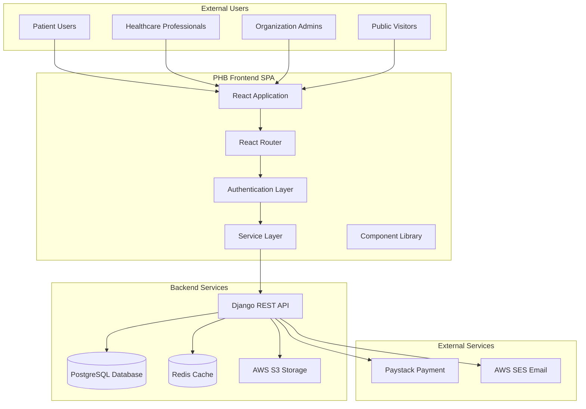
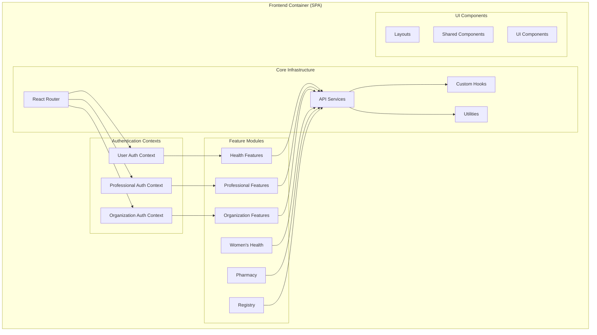
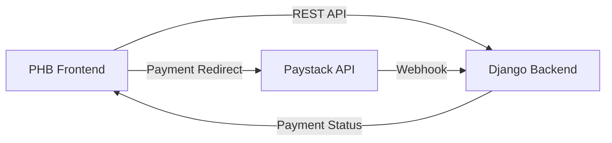

# PHB Hospital System - Architecture Overview

## Executive Summary

The PHB (Public Health Bureau) Hospital System is a comprehensive healthcare management platform built as a modern Single Page Application (SPA) using React 18 and TypeScript. The system serves multiple user personas including patients, healthcare professionals, and healthcare organizations through a sophisticated multi-tenant architecture.

### System Highlights

- **Codebase Size**: ~165,000 lines of TypeScript/TSX code
- **Architecture**: Multi-tenant SPA with role-based access control
- **Frontend Framework**: React 18 with TypeScript and Vite
- **Deployment**: Static hosting on Netlify with backend API integration
- **Authentication**: Triple-context architecture (Users, Professionals, Organizations)

## Table of Contents

1. [Technology Stack](#technology-stack)
2. [Architectural Overview](#architectural-overview)
3. [Key Design Decisions](#key-design-decisions)
4. [System Boundaries](#system-boundaries)
5. [User Personas](#user-personas)
6. [Core Features](#core-features)
7. [Documentation Index](#documentation-index)

## Technology Stack

### Core Technologies

| Category | Technology | Version | Purpose |
|----------|-----------|---------|---------|
| **Framework** | React | 18.2.0 | UI framework |
| **Language** | TypeScript | 5.2.2 | Type-safe development |
| **Build Tool** | Vite | 6.3.5 | Fast dev server & bundling |
| **Compiler** | SWC | via plugin | Fast TypeScript compilation |
| **Routing** | React Router | 6.15.0 | Client-side routing |
| **State** | Context API | Built-in | Global state management |

### UI & Styling

| Category | Technology | Purpose |
|----------|-----------|---------|
| **CSS Framework** | Tailwind CSS | 3.4.1 | Utility-first styling |
| **Component Library** | Material-UI (MUI) | 7.1.1 | React components |
| **Design System** | Fluent UI | 9.66.3 | Microsoft design system |
| **Icons** | MUI Icons, Fluent Icons, Heroicons | Icon libraries |
| **Animation** | Framer Motion | 12.19.1 | Animations & transitions |

### Data Visualization & Charts

- **Chart.js** (4.4.8) - General purpose charting
- **Recharts** (2.10.3) - React-specific charts
- **react-chartjs-2** (5.3.0) - Chart.js React wrapper

### HTTP & API Integration

- **Axios** (1.9.0) - HTTP client for complex requests
- **Fetch API** - Native browser API for simple requests
- **Credentials**: Uses `credentials: 'include'` for cookie-based auth

### Medical & Healthcare

| Library | Purpose |
|---------|---------|
| **cornerstone-core** (2.6.1) | DICOM medical imaging |
| **dicom-parser** (1.8.21) | DICOM file parsing |
| **Canvas** (3.1.0) | Image manipulation |
| **Tesseract.js** (6.0.1) | OCR for medical documents |
| **PDF-lib** (1.17.1) | PDF generation & manipulation |

### Calendar & Scheduling

- **react-big-calendar** (1.19.2) - Full calendar component
- **date-fns** (4.1.0) - Date manipulation utilities
- **react-day-picker** (9.7.0) - Date picker component

### Payment Integration

- **Paystack** - Integrated via REST API for appointment payments

### Forms & UI Utilities

- **react-qr-code** (2.0.18) - QR code generation
- **html5-qrcode** (2.3.8) - QR code scanning
- **react-barcode** (1.6.1) - Barcode generation
- **react-markdown** (10.1.0) - Markdown rendering
- **react-to-print** (3.2.0) - Print functionality

### Development Tools

| Tool | Purpose |
|------|---------|
| **ESLint** | Code linting with TypeScript support |
| **Prettier** | Code formatting |
| **Terser** | Production minification |
| **TypeScript** | Type checking & compilation |

## Architectural Overview

### High-Level Architecture (C4 Level 1)



### Container Architecture (C4 Level 2)



## Key Design Decisions (ADRs)

### ADR-001: Multi-Context Authentication Architecture

**Decision**: Implement three separate authentication contexts instead of a unified auth system.

**Rationale**:
- Different user types have distinct authentication flows
- Separation of concerns for security boundaries
- Independent session management requirements
- Different token storage strategies

**Contexts**:
1. **AuthContext** (`authContext.tsx`) - Regular users/patients
2. **ProfessionalAuthContext** (`professionalAuthContext.tsx`) - Healthcare professionals
3. **OrganizationAuthContext** (`organizationAuthContext.tsx`) - Organization admins

**Trade-offs**:
- ✅ Clear security boundaries
- ✅ Specialized authentication logic
- ✅ Independent scaling
- ⚠️ Code duplication
- ⚠️ Increased complexity
- ⚠️ Multiple token management strategies

### ADR-002: Vite with SWC for Build Tooling

**Decision**: Use Vite with SWC compiler instead of Create React App or Webpack.

**Rationale**:
- Significantly faster development server startup
- Faster Hot Module Replacement (HMR)
- Native ES modules support
- Better TypeScript compilation performance
- Smaller bundle sizes with better tree-shaking

**Configuration** (`vite.config.ts:1-37`):
```typescript
{
  build: {
    minify: 'terser',
    sourcemap: false,
    rollupOptions: {
      output: {
        manualChunks: {
          vendor: ['react', 'react-dom', 'react-router-dom'],
          ui: ['chart.js', 'react-chartjs-2']
        }
      }
    }
  }
}
```

### ADR-003: Feature-Based Code Organization

**Decision**: Organize code by features rather than technical layers.

**Structure**:
```
src/
├── features/           # Feature modules
│   ├── auth/          # Authentication features
│   ├── health/        # Health management
│   ├── professional/  # Professional features
│   ├── organization/  # Organization features
│   ├── pharmacy/      # Pharmacy features
│   └── womens-health/ # Women's health tracking
├── components/        # Shared UI components
├── services/          # API service layer
├── hooks/             # Custom React hooks
└── utils/             # Utility functions
```

**Rationale**:
- Better feature encapsulation
- Easier to locate related code
- Facilitates micro-frontend migration
- Clear feature boundaries
- Supports team scalability

### ADR-004: Hybrid Styling Approach

**Decision**: Use multiple UI libraries (Tailwind, MUI, Fluent UI) instead of a single design system.

**Rationale**:
- **Tailwind CSS**: Utility-first for custom components
- **Material-UI**: Rapid prototyping and complex components
- **Fluent UI**: Organization dashboard modern aesthetics

**Trade-offs**:
- ✅ Flexibility in UI development
- ✅ Access to rich component ecosystems
- ⚠️ Larger bundle size
- ⚠️ Inconsistent design language
- ⚠️ Learning curve for developers

### ADR-005: Service Layer Abstraction

**Decision**: Implement a dedicated service layer for all API interactions.

**Services** (`src/services/`):
- `appointmentService.ts` - Appointment management
- `paymentService.ts` - Payment processing
- `pharmacyService.ts` - Pharmacy operations
- `womensHealthApi.ts` - Women's health tracking
- `registryService.ts` - Professional registry
- `drugService.ts` - Drug database
- `guidelinesService.ts` - Clinical guidelines

**Benefits**:
- Centralized API logic
- Easier testing and mocking
- Consistent error handling
- Type-safe API contracts
- Simplified component code

### ADR-006: Cookie-Based Authentication (Migration)

**Status**: Partially implemented, migration in progress

**Decision**: Migrate from localStorage tokens to httpOnly cookies.

**Current State**:
- ✅ Organization auth: Using httpOnly cookies
- ⚠️ User auth: Still using localStorage
- ⚠️ Professional auth: Still using localStorage

**Security Benefits**:
- Protection against XSS attacks
- Automatic token transmission
- Server-side token management
- CSRF protection with proper headers

## System Boundaries

### Frontend Responsibilities

**What the Frontend Does**:
- User interface rendering and interactions
- Client-side routing and navigation
- Form validation and user input handling
- State management (authentication, UI state)
- API request orchestration
- Client-side data caching (minimal)
- PDF generation and QR code rendering
- Medical image visualization (DICOM)

**What the Frontend Does NOT Do**:
- Business logic execution (delegated to backend)
- Data persistence (except auth tokens and preferences)
- Payment processing (handled by Paystack + backend)
- Email sending (backend responsibility)
- Complex calculations (medical algorithms on backend)
- File virus scanning (backend service)

### Integration Points



## User Personas

### 1. Patient Users

**Authentication**: AuthContext (`authContext.tsx`)

**Key Flows**:
- Account creation with onboarding
- Appointment booking with payment
- Medical records access (OTP protected)
- Prescription requests
- Women's health tracking
- Test results viewing

**Protected Routes**: `/account/*`

### 2. Healthcare Professionals

**Authentication**: ProfessionalAuthContext (`professionalAuthContext.tsx`)

**Roles**:
- Doctor
- Nurse
- Pharmacist
- Researcher
- Lab Technician
- Radiographer
- Midwife
- Dentist
- Optometrist

**Key Flows**:
- Professional registration and verification
- Patient management
- Appointment scheduling
- Prescription triage and approval
- Clinical guidelines access
- Research data visualization
- Practice page management

**Protected Routes**: `/professional/*`

### 3. Organization Administrators

**Authentication**: OrganizationAuthContext (`organizationAuthContext.tsx`)

**Organization Types**:
- Hospital administrators
- NGO administrators
- Pharmacy administrators

**Key Flows**:
- Organization registration with verification
- User registration approval
- Patient admission management
- Staff roster management
- Ward management
- Inventory tracking
- Analytics dashboards
- License management

**Protected Routes**: `/organization/*`

### 4. Public Visitors

**Authentication**: None required

**Accessible Content**:
- Health information (conditions, medicines)
- Pregnancy resources and calculators
- Mental health resources
- Live well guides
- Service information
- Professional registry search
- Practice page directory

## Core Features

### 1. Health Management (User Features)

**Location**: `src/features/health/`

**Components**:
- Medical Records (`MedicalRecords.tsx`)
- Appointments (`Appointments.tsx`)
- Prescriptions (`Prescriptions.tsx`)
- GP Health Record (`GPHealthRecord.tsx`)
- Test Results (`TestResults.tsx`)
- Payment History (`PaymentHistory.tsx`)

**Services**:
- `appointmentService.ts` - Appointment CRUD and conflict checking
- `paymentService.ts` - Paystack integration and payment verification

**Key Flows**:
1. **Appointment Booking**:
   - Select department and urgency
   - Check for conflicts
   - Payment via Paystack
   - Confirmation and calendar invite

2. **Medical Records Access**:
   - OTP verification required
   - Time-limited access
   - Encrypted file viewing
   - Audit logging

### 2. Women's Health Tracking

**Location**: `src/features/womens-health/`, `src/pages/account/womens-health/`

**Features**:
- Daily health log
- Cycle calendar and tracking
- Pregnancy journey tracker
- Fertility monitoring
- Health goals
- Educational resources

**Service**: `womensHealthApi.ts`

**Database**: Dedicated women's health schema (see `WOMENS_HEALTH_DATABASE_SPEC.md`)

### 3. Professional Features

**Location**: `src/features/professional/`

**Sub-modules**:
- **Patients** (`patients/`) - Patient management and communication
- **Calculators** (`calculators/`) - Clinical calculation tools
- **Research** (`research/`) - Data visualization

**Key Components**:
- Professional calendar (`ProfessionalCalendar.tsx`)
- Prescription triage (`PrescriptionTriageModal.tsx`)
- Practice page wizard (`CreatePracticePageWizard.tsx`)
- Medical access tab (`MedicalAccessTab.tsx`)

### 4. Pharmacy Integration

**Location**: `src/features/pharmacy/`

**Components**:
- QR Scanner (`QRScanner.tsx`)
- Prescription list (`PharmacyPrescriptionList.tsx`)
- HPN search (`PharmacyHPNSearch.tsx`)

**Service**: `pharmacyPrescriptionService.ts`

**Workflow**:
1. Scan prescription QR code or search by HPN
2. Verify prescription authenticity
3. Dispense medication
4. Update prescription status

### 5. Organization Management

**Location**: `src/features/organization/`

**Dashboards**:
- Hospital Dashboard (`dashboards/FluentHospitalDashboard.tsx`)
- NGO Dashboard (`dashboards/FluentNGODashboard.tsx`)
- Pharmacy Dashboard (`dashboards/FluentPharmaDashboard.tsx`)

**Key Features**:
- Patient admissions tracking
- User registration approval
- Ward and bed management
- Staff roster scheduling
- Inventory management
- Analytics and reporting

### 6. Professional Registry

**Location**: `src/pages/registry/`, `src/features/registry/`

**Components**:
- Landing page with search (`RegistryLandingPage.tsx`)
- Application form (`ProfessionalApplicationForm.tsx`)
- Application status dashboard (`RegistryDashboardPage.tsx`)
- Professional profiles (`ProfessionalProfilePage.tsx`)

**Service**: `registryService.ts`

**Workflow**:
1. Professional submits application
2. Admin reviews and verifies credentials
3. Approval/rejection with feedback
4. Public profile creation
5. Searchable directory

### 7. Clinical Guidelines System

**Location**: `src/pages/organization/ClinicalGuidelinesManagementPage.tsx`

**Service**: `guidelinesService.ts`

**Features**:
- Guideline upload and management
- Version control
- Category organization
- Search and filtering
- Access control

### 8. Advanced Search

**Location**: `src/features/search/`

**Components**:
- Advanced search (`AdvancedSearchPage.tsx`)
- Body map search (`BodyMapSearch.tsx`)
- 3D body model (`BodyModel3D.tsx`)
- Symptom checker (`SymptomChecker.tsx`)
- Medical term highlighting (`MedicalTermHighlighter.tsx`)
- "Did you mean" suggestions (`DidYouMean.tsx`)

### 9. Security Features

**Location**: `src/components/security/`

**Components**:
- Secure file upload (`SecureFileUpload.tsx`)
- Virus scanner (`VirusScanner.tsx`)
- File validator (`FileValidator.tsx`)
- Encrypted preview (`EncryptedPreview.tsx`)
- Upload progress (`UploadProgress.tsx`)

**Features**:
- File type validation
- Size limits
- Virus scanning integration
- Encryption at rest
- Audit logging

## Documentation Index

For detailed information, refer to these documents:

| Document | Description | Location |
|----------|-------------|----------|
| **System Design** | Detailed technical architecture, components, and interactions | [SYSTEM-DESIGN.md](SYSTEM-DESIGN.md) |
| **API Documentation** | Complete API endpoint reference and integration guide | [API-DOCUMENTATION.md](./API-DOCUMENTATION.md) |
| **Database Schema** | Data models and relationships | [DATABASE-SCHEMA.md](./DATABASE-SCHEMA.md) |
| **Security Review** | Security architecture and vulnerability assessment | [SECURITY-REVIEW.md](SECURITY-REVIEW.md) |
| **Performance Analysis** | Performance metrics and optimization opportunities | [PERFORMANCE-ANALYSIS.md](./PERFORMANCE-ANALYSIS.md) |
| **Improvement Roadmap** | Prioritized architectural improvements | [IMPROVEMENT-ROADMAP.md](IMPROVEMENT-ROADMAP.md) |

## Quick Reference

### Development Commands

```bash
# Development server
bun run dev

# Type checking
bun run typecheck

# Linting
bun run lint

# Production build
bun run build

# Deploy to Netlify
bun run deploy
```

### Environment Configuration

**File**: `.env` (see `.env.example`)

```bash
VITE_API_BASE_URL=http://127.0.0.1:8000/
```

### Project Statistics

- **Total Lines of Code**: ~165,000
- **TypeScript/TSX Files**: Majority of codebase
- **Components**: 100+ reusable components
- **Pages**: 150+ route pages
- **Services**: 12 API service modules
- **Features**: 9 major feature modules
- **Hooks**: 5 custom hooks

### Browser Support

**Modern browsers with ES2020 support**:
- Chrome/Edge (latest)
- Firefox (latest)
- Safari (latest)

**Not supported**:
- Internet Explorer
- Legacy browsers without ES module support

### Deployment

**Platform**: Netlify

**Configuration**: `netlify.toml`

```toml
[build]
  command = "bun run build"
  publish = "dist"

[[redirects]]
  from = "/*"
  to = "/index.html"
  status = 200
```

## Getting Started

1. **Clone Repository**
   ```bash
   git clone <repository-url>
   cd phbfrontend
   ```

2. **Install Dependencies**
   ```bash
   bun install
   ```

3. **Configure Environment**
   ```bash
   cp .env.example .env
   # Edit .env with your backend URL
   ```

4. **Run Development Server**
   ```bash
   bun run dev
   ```

5. **Access Application**
   ```
   http://localhost:5173
   ```

## Support & Contact

For architectural questions or concerns:
- Review detailed documentation in this repository
- Check existing issues and design decisions
- Consult the development team

---

**Document Version**: 1.0.0
**Last Updated**: 2025-01-18
**Maintained By**: PHB Development Team