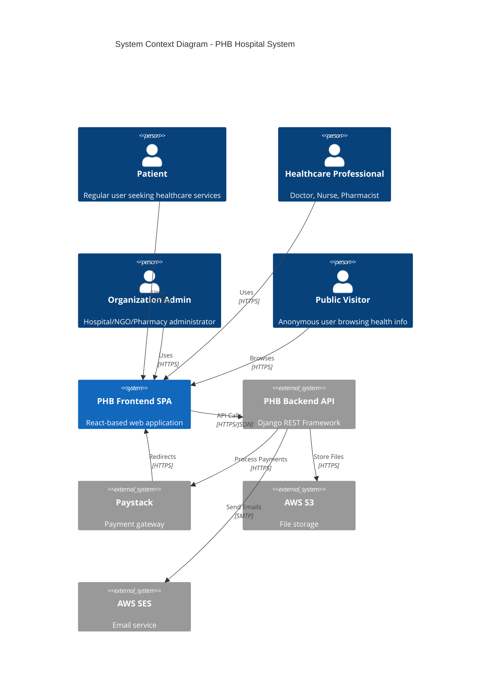
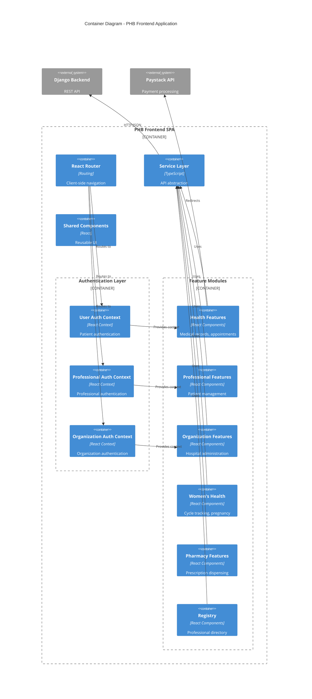
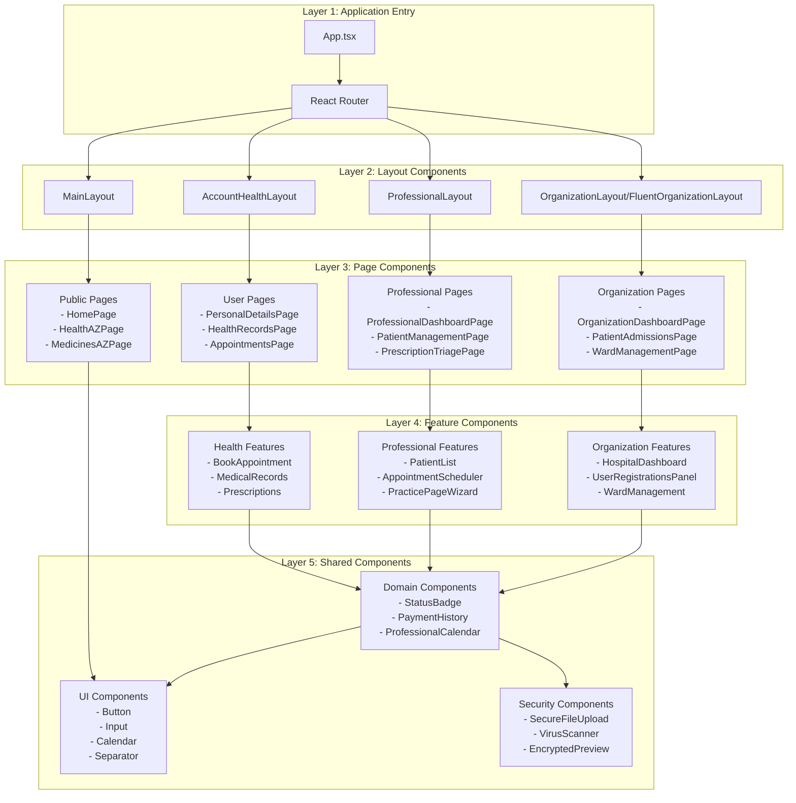
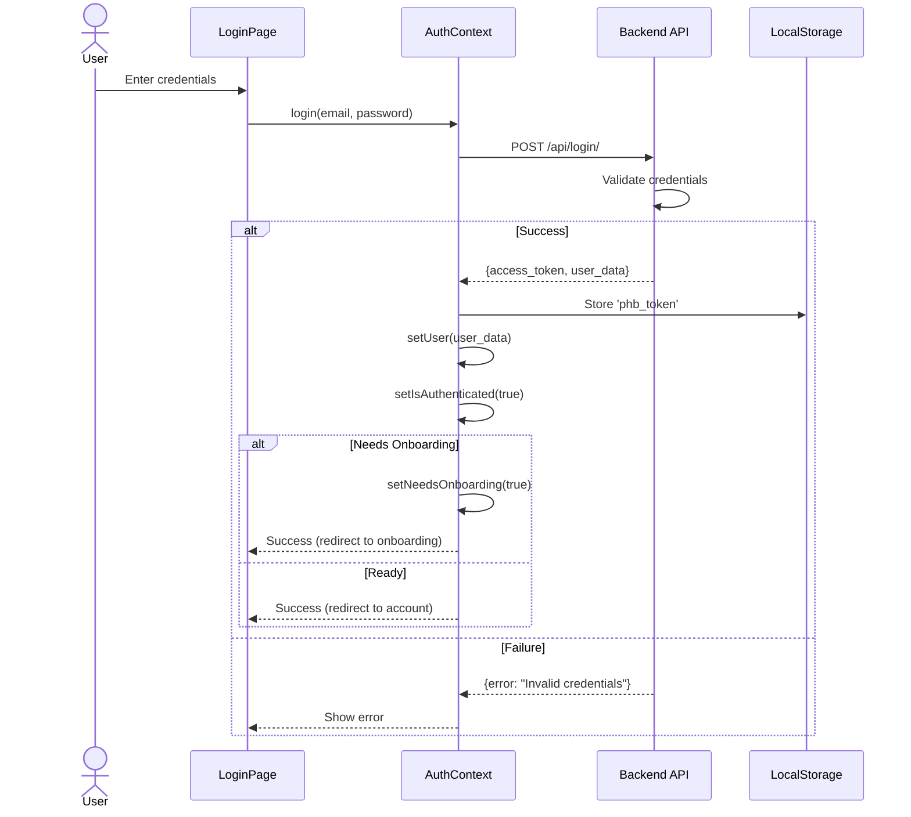
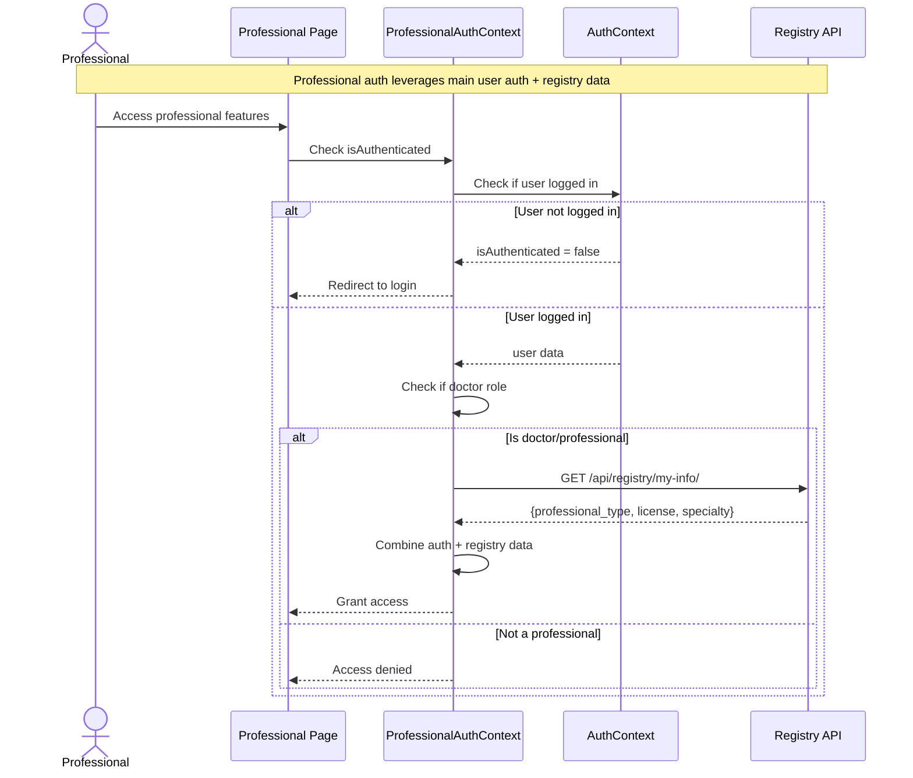
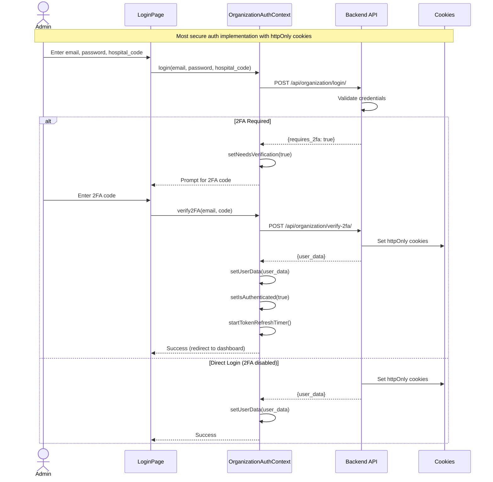
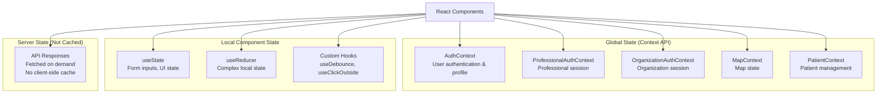
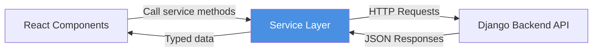
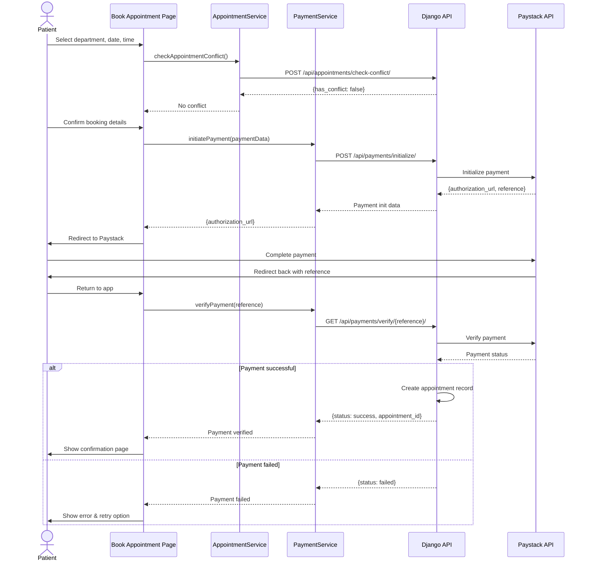

# PHB Hospital System - System Design Document

## Table of Contents

1. [System Overview](#system-overview)
2. [Component Architecture](#component-architecture)
3. [Authentication Architecture](#authentication-architecture)
4. [Routing Architecture](#routing-architecture)
5. [State Management](#state-management)
6. [Service Layer](#service-layer)
7. [Critical User Flows](#critical-user-flows)
8. [Data Flow Patterns](#data-flow-patterns)
9. [Component Catalog](#component-catalog)
10. [Integration Patterns](#integration-patterns)

## System Overview

### Architecture Style

The PHB Hospital System follows a **Multi-Tenant Single Page Application (SPA)** architecture with the following characteristics:

- **Frontend Pattern**: Component-based React architecture
- **Backend Integration**: RESTful API with Django backend
- **Authentication**: Triple-context JWT-based authentication
- **Deployment**: Static hosting (Netlify) with API backend
- **State Management**: React Context API with local component state
- **Routing**: Client-side routing with React Router v6

### System Context (C4 Level 1)



### Container Architecture (C4 Level 2)



## Component Architecture

### Component Layer Hierarchy



### Component Organization

```
src/
├── App.tsx                           # Root application component
├── main.tsx                          # Application entry point
│
├── components/                       # Shared components (Layer 5)
│   ├── ui/                          # Base UI primitives
│   │   ├── button.tsx
│   │   ├── calendar.tsx
│   │   ├── separator.tsx
│   │   └── PhoneInput.tsx
│   ├── security/                    # Security components
│   │   ├── SecureFileUpload.tsx
│   │   ├── VirusScanner.tsx
│   │   ├── FileValidator.tsx
│   │   └── EncryptedPreview.tsx
│   ├── professional/                # Professional-specific shared
│   │   ├── CreatePracticePageWizard.tsx
│   │   └── PrescriptionTriageModal.tsx
│   ├── registry/                    # Registry shared
│   ├── womenshealth/               # Women's health shared
│   └── [Domain Components]          # Feature-agnostic shared
│       ├── Header.tsx
│       ├── Footer.tsx
│       ├── StatusBadge.tsx
│       ├── PaymentHistory.tsx
│       └── ProfessionalCalendar.tsx
│
├── features/                        # Feature modules (Layer 4)
│   ├── auth/                       # Authentication features
│   │   ├── authContext.tsx
│   │   ├── LoginForm.tsx
│   │   ├── RegisterForm.tsx
│   │   ├── OnboardingFlow.tsx
│   │   └── OTPVerification.tsx
│   ├── health/                     # Health management features
│   │   ├── BookAppointment.tsx
│   │   ├── ViewAppointments.tsx
│   │   ├── MedicalRecords.tsx
│   │   ├── Prescriptions.tsx
│   │   ├── GPHealthRecord.tsx
│   │   └── TestResults.tsx
│   ├── professional/               # Professional features
│   │   ├── professionalAuthContext.tsx
│   │   ├── ProfessionalLoginForm.tsx
│   │   ├── patients/
│   │   │   ├── PatientList.tsx
│   │   │   ├── PatientDetail.tsx
│   │   │   └── AppointmentScheduler.tsx
│   │   └── calculators/
│   │       └── ClinicalCalculators.tsx
│   ├── organization/               # Organization features
│   │   ├── organizationAuthContext.tsx
│   │   ├── OrganizationLoginForm.tsx
│   │   ├── dashboards/
│   │   │   ├── FluentHospitalDashboard.tsx
│   │   │   ├── FluentNGODashboard.tsx
│   │   │   └── FluentPharmaDashboard.tsx
│   │   └── components/
│   │       └── UserRegistrationsPanel.tsx
│   ├── pharmacy/                   # Pharmacy features
│   │   ├── QRScanner.tsx
│   │   ├── PharmacyPrescriptionList.tsx
│   │   └── PharmacyHPNSearch.tsx
│   ├── womens-health/             # Women's health features
│   │   └── WomensHealthHub.tsx
│   ├── registry/                   # Professional registry
│   │   ├── ProfessionalApplicationForm.tsx
│   │   └── ApplicationFormSteps.tsx
│   └── search/                     # Advanced search features
│       ├── AdvancedSearchPage.tsx
│       ├── BodyMapSearch.tsx
│       └── SymptomChecker.tsx
│
├── layouts/                        # Layout components (Layer 2)
│   ├── MainLayout.tsx             # Public pages layout
│   ├── ProfessionalLayout.tsx     # Professional pages layout
│   ├── OrganizationLayout.tsx     # Organization pages layout
│   ├── FluentOrganizationLayout.tsx  # Modern org layout
│   └── AccountHealthLayout.tsx    # Account pages layout
│
├── pages/                          # Page components (Layer 3)
│   ├── HomePage.tsx
│   ├── LoginPage.tsx
│   ├── account/                   # User account pages
│   │   ├── PersonalDetailsPage.tsx
│   │   ├── HealthRecordsPage.tsx
│   │   ├── SecuritySettingsPage.tsx
│   │   └── womens-health/
│   │       ├── DailyHealthLog.tsx
│   │       ├── CycleCalendar.tsx
│   │       └── PregnancyTracker.tsx
│   ├── professional/              # Professional pages
│   │   ├── ProfessionalDashboardPage.tsx
│   │   ├── PatientManagementPage.tsx
│   │   └── PrescriptionTriagePage.tsx
│   ├── organization/              # Organization pages
│   │   ├── OrganizationDashboardPage.tsx
│   │   ├── PatientAdmissionsPage.tsx
│   │   └── WardManagementPage.tsx
│   └── registry/                  # Registry pages
│       ├── RegistryLandingPage.tsx
│       └── ApplicationDetailPage.tsx
│
├── services/                       # Service layer
│   ├── appointmentService.ts
│   ├── paymentService.ts
│   ├── pharmacyService.ts
│   ├── womensHealthApi.ts
│   └── [Additional services]
│
├── hooks/                          # Custom hooks
│   ├── useDebounce.ts
│   ├── useClickOutside.ts
│   └── [Additional hooks]
│
└── utils/                          # Utility functions
    ├── config.ts
    ├── authDebug.ts
    └── [Additional utilities]
```

## Authentication Architecture

### Triple-Context Authentication System

The PHB system implements three independent authentication contexts, each serving different user types with distinct security requirements.

### Authentication Context Comparison

| Feature | User Auth | Professional Auth | Organization Auth |
|---------|-----------|------------------|-------------------|
| **Context File** | `authContext.tsx` | `professionalAuthContext.tsx` | `organizationAuthContext.tsx` |
| **Token Storage** | localStorage | localStorage | httpOnly cookies ✅ |
| **Token Keys** | `phb_token` | `phb_professional_token` | Cookies |
| **Session Management** | Manual | Manual | Auto-refresh |
| **2FA Support** | Optional | No | Yes (required) |
| **Onboarding Flow** | Yes | No | Verification required |
| **Primary Use** | Patient users | Medical professionals | Admins |

### User Authentication Flow (AuthContext)



**File**: `src/features/auth/authContext.tsx:1-100`

**Key Features**:
- JWT token stored in `localStorage` with key `phb_token`
- User profile caching
- Onboarding completion tracking
- Contact preferences management
- Primary hospital registration
- OTP-based medical records access
- Password reset with email verification

**Security Considerations**:
- ⚠️ **XSS Vulnerable**: Tokens stored in localStorage
- ⚠️ **Planned Migration**: Moving to httpOnly cookies
- ✅ **HTTPS Required**: All communication encrypted
- ✅ **OTP Protection**: Sensitive data access requires additional verification

### Professional Authentication Flow



**File**: `src/features/professional/professionalAuthContext.tsx:1-100`

**Key Features**:
- Leverages main AuthContext user authentication
- Fetches additional professional data from Registry API
- Role-based access control via `hasAccess(requiredRoles)`
- Supports multiple professional roles (doctor, nurse, pharmacist, etc.)
- View preference toggle (patient view vs professional view)

**Hybrid Authentication**:
```typescript
// Combines main user auth with professional registry data
const { user, isAuthenticated } = useAuth(); // Main auth
const professionalInfo = await fetchProfessionalInfo(); // Registry data

const professionalUser = {
  ...user,
  ...professionalInfo,
  role: professionalInfo.professional_type
};
```

### Organization Authentication Flow (Cookie-Based)



**File**: `src/features/organization/organizationAuthContext.tsx:1-100`

**Key Features** (Most Secure):
- ✅ **HttpOnly Cookies**: XSS-protected token storage
- ✅ **Automatic Refresh**: Token refresh every 25 minutes
- ✅ **2FA Required**: Enhanced security for organization admins
- ✅ **Remember Device**: Optional device trust
- ✅ **Session Management**: Centralized session tracking
- ✅ **CSRF Protection**: Credentials included with all requests

**Cookie Configuration**:
```typescript
// Cookies set by backend
{
  access_token: {
    httpOnly: true,
    secure: true,
    sameSite: 'Lax',
    maxAge: 1800 // 30 minutes
  },
  refresh_token: {
    httpOnly: true,
    secure: true,
    sameSite: 'Lax',
    maxAge: 604800 // 7 days
  }
}
```

**Automatic Token Refresh**:
```typescript
// Refresh access token every 25 minutes
useEffect(() => {
  if (isAuthenticated) {
    const refreshTimer = setInterval(async () => {
      await refreshAccessToken();
    }, 25 * 60 * 1000); // 25 minutes

    return () => clearInterval(refreshTimer);
  }
}, [isAuthenticated]);
```

## Routing Architecture

### Route Structure

The application uses **React Router v6** with a hierarchical route structure organized by user type.

```mermaid
graph TB
    App[App.tsx<br/>BrowserRouter]

    subgraph "Public Routes (No Auth)"
        PublicMain[MainLayout]
        HomePage[/]
        Health[/health-a-z]
        Medicines[/medicines-a-z]
        Pregnancy[/pregnancy/*]
        LiveWell[/live-well/*]
        MentalHealth[/mental-health/*]
    end

    subgraph "User Routes (AuthContext)"
        AccountLayout[AccountHealthLayout]
        Login[/login]
        Register[/register]
        Account[/account]
        PersonalDetails[/account/personal-details]
        HealthRecords[/account/health-records]
        Appointments[/account/appointments]
        WomensHealth[/account/womens-health/*]
    end

    subgraph "Professional Routes (ProfessionalAuthContext)"
        ProfLayout[ProfessionalLayout]
        ProfLogin[/professional/login]
        ProfDash[/professional/dashboard]
        Patients[/professional/patients]
        ProfAppts[/professional/appointments]
        PrescriptionTriage[/professional/prescription-triage]
    end

    subgraph "Organization Routes (OrganizationAuthContext)"
        OrgLayout[FluentOrganizationLayout]
        OrgLogin[/organization/login]
        OrgDash[/organization/dashboard]
        Admissions[/organization/admissions]
        UserRegs[/organization/user-registrations]
        Wards[/organization/ward-management]
    end

    App --> PublicMain
    App --> Login
    App --> Register
    App --> ProfLogin
    App --> OrgLogin

    PublicMain --> HomePage
    PublicMain --> Health
    PublicMain --> Medicines
    PublicMain --> Pregnancy
    PublicMain --> LiveWell
    PublicMain --> MentalHealth

    Login -.Auth Required.-> AccountLayout
    AccountLayout --> Account
    AccountLayout --> PersonalDetails
    AccountLayout --> HealthRecords
    AccountLayout --> Appointments
    AccountLayout --> WomensHealth

    ProfLogin -.Auth Required.-> ProfLayout
    ProfLayout --> ProfDash
    ProfLayout --> Patients
    ProfLayout --> ProfAppts
    ProfLayout --> PrescriptionTriage

    OrgLogin -.Auth Required.-> OrgLayout
    OrgLayout --> OrgDash
    OrgLayout --> Admissions
    OrgLayout --> UserRegs
    OrgLayout --> Wards
```

### Route Guards

#### Protected Route (User Authentication)

**Implementation** (`App.tsx`):
```typescript
const ProtectedRoute = ({ children }: { children: React.ReactNode }) => {
  const { isAuthenticated, isLoading, needsOnboarding } = useAuth();

  if (isLoading) {
    return <div>Loading...</div>;
  }

  if (!isAuthenticated) {
    return <Navigate to="/login" replace />;
  }

  if (needsOnboarding) {
    return <Navigate to="/onboarding" replace />;
  }

  return <>{children}</>;
};
```

#### Professional Route Guard

**Implementation** (`src/features/professional/ProfessionalRouteGuard.tsx`):
```typescript
const ProfessionalRouteGuard = ({ children }: { children: React.ReactNode }) => {
  const { professionalUser, isLoading, isAuthenticated } = useProfessionalAuth();

  if (isLoading) return <LoadingSpinner />;

  if (!isAuthenticated || !professionalUser) {
    return <Navigate to="/professional/login" replace />;
  }

  return <>{children}</>;
};
```

#### Hospital Status Guard

**Implementation** (`src/features/health/HospitalStatusGuard.tsx`):
```typescript
const HospitalStatusGuard = ({ children }: { children: React.ReactNode }) => {
  const { user } = useAuth();

  // Check if user has a registered primary hospital
  if (!user?.primaryHospital) {
    return <Navigate to="/account/link-phb" replace />;
  }

  return <>{children}</>;
};
```

### Route Configuration Example

**File**: `src/App.tsx` (excerpt)

```typescript
<Router>
  <ScrollToTop />
  <Routes>
    {/* Public Routes */}
    <Route element={<MainLayout />}>
      <Route path="/" element={<HomePage />} />
      <Route path="/health-a-z" element={<HealthAZPage />} />
      <Route path="/medicines-a-z" element={<MedicinesAZPage />} />
    </Route>

    {/* User Authentication Routes */}
    <Route path="/login" element={<LoginPage />} />
    <Route path="/register" element={<RegisterPage />} />

    {/* Protected User Routes */}
    <Route element={<ProtectedRoute><AccountHealthLayout /></ProtectedRoute>}>
      <Route path="/account" element={<AccountPage />} />
      <Route path="/account/personal-details" element={<PersonalDetailsPage />} />

      {/* Appointment routes with hospital status check */}
      <Route element={<HospitalStatusGuard><Outlet /></HospitalStatusGuard>}>
        <Route path="/account/appointments" element={<ViewAppointments />} />
        <Route path="/account/book-appointment" element={<BookAppointment />} />
      </Route>

      {/* Women's Health Routes */}
      <Route path="/account/womens-health" element={<WomensHealthDashboardEnhanced />} />
      <Route path="/account/womens-health/daily-log" element={<DailyHealthLog />} />
    </Route>

    {/* Professional Routes */}
    <Route path="/professional/login" element={<ProfessionalLoginPage />} />
    <Route element={<ProfessionalRouteGuard><ProfessionalLayout /></ProfessionalRouteGuard>}>
      <Route path="/professional/dashboard" element={<ProfessionalDashboardPage />} />
      <Route path="/professional/patients" element={<ProfessionalPatientsPage />} />
    </Route>

    {/* Organization Routes */}
    <Route path="/organization/login" element={<OrganizationLoginPage />} />
    <Route element={<OrganizationRouteGuard><FluentOrganizationLayout /></OrganizationRouteGuard>}>
      <Route path="/organization/dashboard" element={<FluentDashboardPage />} />
      <Route path="/organization/admissions" element={<PatientAdmissionsPage />} />
    </Route>
  </Routes>
</Router>
```

## State Management

### State Management Strategy

The PHB system uses a **Context API + Local State** pattern rather than external state management libraries (Redux, Zustand, etc.).



### Context Providers Hierarchy

**File**: `src/main.tsx`, `src/App.tsx`

```typescript
// Provider wrapping hierarchy
<React.StrictMode>
  <AuthProvider>           {/* User authentication */}
    <ProfessionalAuthProvider>  {/* Professional authentication */}
      <OrganizationAuthProvider> {/* Organization authentication */}
        <BrowserRouter>
          <App />
        </BrowserRouter>
      </OrganizationAuthProvider>
    </ProfessionalAuthProvider>
  </AuthProvider>
</React.StrictMode>
```

### Custom Hooks

**Location**: `src/hooks/`

#### useDebounce Hook

**File**: `src/hooks/useDebounce.ts`

**Purpose**: Debounce search inputs and API calls

```typescript
function useDebounce<T>(value: T, delay: number): T {
  const [debouncedValue, setDebouncedValue] = useState<T>(value);

  useEffect(() => {
    const handler = setTimeout(() => {
      setDebouncedValue(value);
    }, delay);

    return () => clearTimeout(handler);
  }, [value, delay]);

  return debouncedValue;
}
```

**Usage**:
```typescript
const [searchTerm, setSearchTerm] = useState('');
const debouncedSearch = useDebounce(searchTerm, 500);

useEffect(() => {
  if (debouncedSearch) {
    searchAPI(debouncedSearch);
  }
}, [debouncedSearch]);
```

#### useClickOutside Hook

**File**: `src/hooks/useClickOutside.ts`

**Purpose**: Detect clicks outside of element (modals, dropdowns)

```typescript
function useClickOutside(ref: RefObject<HTMLElement>, handler: () => void) {
  useEffect(() => {
    const listener = (event: MouseEvent | TouchEvent) => {
      if (!ref.current || ref.current.contains(event.target as Node)) {
        return;
      }
      handler();
    };

    document.addEventListener('mousedown', listener);
    document.addEventListener('touchstart', listener);

    return () => {
      document.removeEventListener('mousedown', listener);
      document.removeEventListener('touchstart', listener);
    };
  }, [ref, handler]);
}
```

## Service Layer

### Service Layer Architecture

All API communications go through a dedicated service layer, providing:
- Centralized API logic
- Type-safe API contracts (TypeScript interfaces)
- Consistent error handling
- Request/response transformation
- Authentication header management



### Service Module Catalog

**Location**: `src/services/`

| Service | File | Purpose | Key Methods |
|---------|------|---------|-------------|
| **Appointments** | `appointmentService.ts` | Appointment booking & management | `getAppointments()`, `checkConflict()`, `bookAppointment()` |
| **Payments** | `paymentService.ts` | Paystack integration | `initiatePayment()`, `verifyPayment()`, `getHistory()` |
| **Pharmacy** | `pharmacyService.ts` | Pharmacy operations | `searchPharmacies()`, `getNominatedPharmacy()` |
| **Prescriptions** | `pharmacyPrescriptionService.ts` | Prescription dispensing | `scanQR()`, `dispensePrescription()` |
| **Women's Health** | `womensHealthApi.ts` | Cycle & pregnancy tracking | `logCycleData()`, `getPregnancyJourney()` |
| **Registry** | `registryService.ts` | Professional registry | `submitApplication()`, `searchProfessionals()` |
| **Drugs** | `drugService.ts` | Drug database | `searchDrugs()`, `getDrugDetails()` |
| **Guidelines** | `guidelinesService.ts` | Clinical guidelines | `getGuidelines()`, `uploadGuideline()` |
| **Hospital License** | `hospitalLicenseService.ts` | License management | `getLicenses()`, `uploadLicense()` |
| **Staff** | `staffService.ts` | Staff roster | `getStaffRoster()`, `updateRoster()` |
| **Practice Pages** | `practicePageService.ts` | Practice page management | `createPage()`, `updatePage()` |

### Appointment Service Example

**File**: `src/services/appointmentService.ts:1-80`

```typescript
const API_BASE_URL = import.meta.env.VITE_API_BASE_URL || 'http://localhost:8000';

export interface Appointment {
  id: number;
  patient_name: string;
  doctor_name: string;
  department_name: string;
  appointment_date: string;
  appointment_time: string;
  status: 'pending' | 'confirmed' | 'completed' | 'cancelled' | 'no_show';
  created_at: string;
  updated_at: string;
}

export const AppointmentService = {
  async getAppointments(filters?: {
    status?: string;
    department_id?: number;
    date_from?: string;
    date_to?: string;
  }): Promise<AppointmentsResponse> {
    const queryParams = new URLSearchParams();
    if (filters) {
      if (filters.status) queryParams.append('status', filters.status);
      if (filters.department_id) queryParams.append('department_id', filters.department_id.toString());
      if (filters.date_from) queryParams.append('date_from', filters.date_from);
      if (filters.date_to) queryParams.append('date_to', filters.date_to);
    }

    const response = await fetch(
      `${API_BASE_URL}/api/hospitals/appointments/?${queryParams.toString()}`,
      {
        method: 'GET',
        headers: { 'Content-Type': 'application/json' },
        credentials: 'include', // Send cookies
      }
    );

    if (!response.ok) {
      const errorData = await response.json();
      throw new Error(errorData.message || 'Failed to fetch appointments');
    }

    return await response.json();
  },

  async checkAppointmentConflict({
    department,
    date,
    time
  }: {
    department: number;
    date: string;
    time: string;
  }): Promise<ConflictCheckResponse> {
    const response = await fetch(
      `${API_BASE_URL}/api/appointments/check-conflict/`,
      {
        method: 'POST',
        headers: { 'Content-Type': 'application/json' },
        credentials: 'include',
        body: JSON.stringify({ department, date, time })
      }
    );

    return await response.json();
  }
};
```

### Payment Service Example

**File**: `src/services/paymentService.ts:1-60`

```typescript
export interface PaymentData {
  amount: number;
  currency: string;
  appointmentType: string;
  department: string;
  patientEmail: string;
  patientName: string;
  appointmentDate: string;
  appointmentTime: string;
}

export const PaymentService = {
  async initiatePayment(paymentData: PaymentData): Promise<PaymentInitResponse> {
    const response = await fetch(
      `${API_BASE_URL}/api/payments/initialize/`,
      {
        method: 'POST',
        headers: { 'Content-Type': 'application/json' },
        credentials: 'include',
        body: JSON.stringify(paymentData)
      }
    );

    if (!response.ok) {
      throw new Error('Payment initialization failed');
    }

    return await response.json();
  },

  async verifyPayment(reference: string): Promise<PaymentVerificationResponse> {
    const response = await fetch(
      `${API_BASE_URL}/api/payments/verify/${reference}/`,
      {
        method: 'GET',
        headers: { 'Content-Type': 'application/json' },
        credentials: 'include'
      }
    );

    return await response.json();
  }
};
```

### Error Handling Pattern

All services follow a consistent error handling pattern:

```typescript
try {
  const response = await fetch(endpoint, options);

  if (!response.ok) {
    const errorData = await response.json().catch(() => ({}));
    throw new Error(errorData.message || `HTTP ${response.status}`);
  }

  return await response.json();
} catch (error) {
  console.error('Service error:', error);
  throw error; // Re-throw for component handling
}
```

Components handle service errors:

```typescript
try {
  const data = await AppointmentService.getAppointments();
  setAppointments(data.appointments);
} catch (error) {
  toast.error(error.message || 'Failed to load appointments');
  setError(error.message);
}
```

## Critical User Flows

### Flow 1: Appointment Booking with Payment

This is one of the most critical and complex user flows in the system.



**Components Involved**:
1. `src/features/health/BookAppointment.tsx` - Main booking form
2. `src/services/appointmentService.ts` - Appointment API calls
3. `src/services/paymentService.ts` - Payment processing
4. `src/features/health/AppointmentConfirmation.tsx` - Confirmation page

**File References**:
- Booking form: `src/features/health/BookAppointment.tsx`
- Payment service: `src/services/paymentService.ts:1-60`
- Appointment service: `src/services/appointmentService.ts:75-80`

###