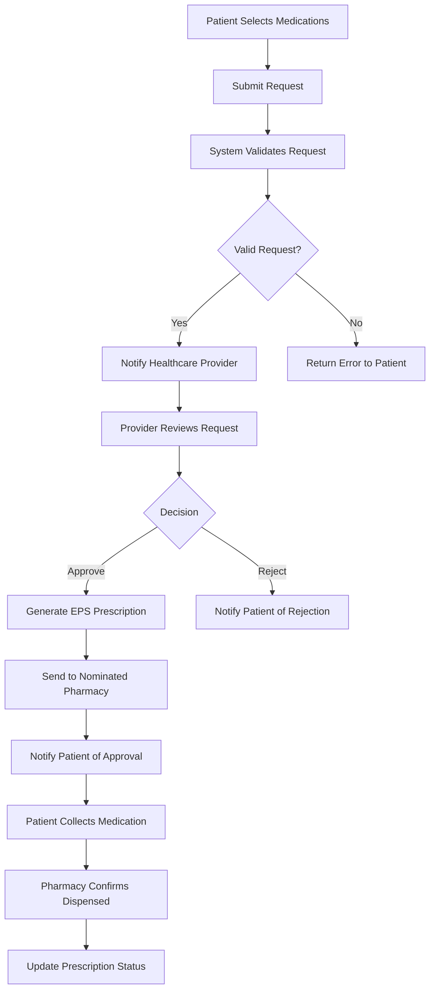

# Prescription Service Backend Implementation

This document outlines the backend implementation details for the PHB Prescription Service, focusing on the electronic prescription request system, pharmacy integration, and healthcare provider interfaces.

## Table of Contents

1. [System Architecture](#system-architecture)
2. [Database Schema](#database-schema)
3. [API Endpoints](#api-endpoints)
4. [Authentication & Authorization](#authentication--authorization)
5. [Integration Points](#integration-points)
6. [Security Considerations](#security-considerations)
7. [Workflow Logic](#workflow-logic)
8. [Notification System](#notification-system)
9. [Testing Strategy](#testing-strategy)
10. [Deployment Notes](#deployment-notes)

## System Architecture

The Prescription Service backend follows a microservice architecture with the following components:

```
┌─────────────────────┐  ┌──────────────────────┐  ┌─────────────────────┐
│                     │  │                      │  │                     │
│   PHB Web/Mobile    │  │  PHB Authentication  │  │ Healthcare Provider │
│     Application     │◄─┼─►      Service       │◄─┼─►     Systems       │
│                     │  │                      │  │                     │
└─────────┬───────────┘  └──────────────────────┘  └─────────┬───────────┘
          │                                                   │
          │                                                   │
┌─────────▼───────────┐                             ┌─────────▼───────────┐
│                     │                             │                     │
│   API Gateway &     │                             │ EPS Integration     │
│   Load Balancer     │                             │ Service             │
│                     │                             │                     │
└─────────┬───────────┘                             └─────────┬───────────┘
          │                                                   │
          │                                                   │
┌─────────▼───────────┐  ┌──────────────────────┐  ┌─────────▼───────────┐
│                     │  │                      │  │                     │
│   Prescription      │◄─┼─►    User Profile    │◄─┼─►     Pharmacy      │
│      Service        │  │      Service         │  │     Service         │
│                     │  │                      │  │                     │
└─────────┬───────────┘  └──────────┬───────────┘  └─────────┬───────────┘
          │                         │                        │
          │                         │                        │
          └─────────────┬───────────┴────────────┬───────────┘
                        │                        │
                    ┌───▼────────────────────────▼───┐
                    │                                │
                    │           Database             │
                    │          Cluster               │
                    │                                │
                    └────────────────────────────────┘
```

### Core Services

1. **Prescription Service**:
   - Handles prescription requests from patients
   - Manages prescription lifecycle (requested, approved, rejected, dispensed)
   - Implements business logic for prescription validation

2. **Pharmacy Service**:
   - Manages pharmacy data and relationships
   - Handles nominated pharmacy preferences
   - Coordinates prescription delivery to pharmacies

3. **EPS Integration Service**:
   - Connects to national Electronic Prescription Service
   - Translates between PHB format and EPS format
   - Manages security requirements for healthcare data transmission

4. **User Profile Service**:
   - Manages patient demographics and preferences
   - Stores medication history and allergies
   - Tracks patient-provider relationships

## Database Schema

The system utilizes a PostgreSQL database with the following key tables:

### Prescriptions Table

```sql
CREATE TABLE prescriptions (
  id UUID PRIMARY KEY DEFAULT uuid_generate_v4(),
  patient_id UUID NOT NULL REFERENCES users(id),
  status VARCHAR(50) NOT NULL CHECK (status IN ('REQUESTED', 'APPROVED', 'REJECTED', 'DISPENSED', 'CANCELLED')),
  request_date TIMESTAMP WITH TIME ZONE NOT NULL DEFAULT NOW(),
  approval_date TIMESTAMP WITH TIME ZONE,
  dispensed_date TIMESTAMP WITH TIME ZONE,
  notes TEXT,
  additional_information TEXT,
  pharmacy_id UUID REFERENCES pharmacies(id),
  request_reference VARCHAR(50) UNIQUE NOT NULL,
  eps_reference VARCHAR(100) UNIQUE,
  created_at TIMESTAMP WITH TIME ZONE NOT NULL DEFAULT NOW(),
  updated_at TIMESTAMP WITH TIME ZONE NOT NULL DEFAULT NOW(),
  CONSTRAINT fk_patient_id FOREIGN KEY (patient_id) REFERENCES users(id) ON DELETE RESTRICT
);
```

### Prescription Items Table

```sql
CREATE TABLE prescription_items (
  id UUID PRIMARY KEY DEFAULT uuid_generate_v4(),
  prescription_id UUID NOT NULL REFERENCES prescriptions(id),
  medication_id UUID NOT NULL REFERENCES medications(id),
  dose VARCHAR(100) NOT NULL,
  quantity INTEGER NOT NULL,
  instructions TEXT NOT NULL,
  repeats INTEGER DEFAULT 0,
  is_acute BOOLEAN DEFAULT FALSE,
  created_at TIMESTAMP WITH TIME ZONE NOT NULL DEFAULT NOW(),
  updated_at TIMESTAMP WITH TIME ZONE NOT NULL DEFAULT NOW(),
  CONSTRAINT fk_prescription_id FOREIGN KEY (prescription_id) REFERENCES prescriptions(id) ON DELETE CASCADE,
  CONSTRAINT fk_medication_id FOREIGN KEY (medication_id) REFERENCES medications(id) ON DELETE RESTRICT
);
```

### Medications Table

```sql
CREATE TABLE medications (
  id UUID PRIMARY KEY DEFAULT uuid_generate_v4(),
  name VARCHAR(255) NOT NULL,
  form VARCHAR(100) NOT NULL, -- tablet, capsule, liquid, etc.
  strength VARCHAR(100) NOT NULL,
  formulary_code VARCHAR(50), -- National Formulary code
  dm_d_code VARCHAR(50), -- Dictionary of Medicines and Devices code
  controlled_drug_category VARCHAR(10), -- NULL, CD1, CD2, etc.
  requires_approval BOOLEAN DEFAULT TRUE,
  created_at TIMESTAMP WITH TIME ZONE NOT NULL DEFAULT NOW(),
  updated_at TIMESTAMP WITH TIME ZONE NOT NULL DEFAULT NOW()
);
```

### Pharmacies Table

```sql
CREATE TABLE pharmacies (
  id UUID PRIMARY KEY DEFAULT uuid_generate_v4(),
  name VARCHAR(255) NOT NULL,
  address_line_1 VARCHAR(255) NOT NULL,
  address_line_2 VARCHAR(255),
  city VARCHAR(100) NOT NULL,
  post_code VARCHAR(10) NOT NULL,
  telephone VARCHAR(20) NOT NULL,
  email VARCHAR(255),
  ods_code VARCHAR(20) UNIQUE NOT NULL, -- ODS (Organisation Data Service) code
  is_eps_enabled BOOLEAN DEFAULT TRUE,
  opening_hours JSONB,
  created_at TIMESTAMP WITH TIME ZONE NOT NULL DEFAULT NOW(),
  updated_at TIMESTAMP WITH TIME ZONE NOT NULL DEFAULT NOW()
);
```

### Nominated Pharmacies Table

```sql
CREATE TABLE nominated_pharmacies (
  id UUID PRIMARY KEY DEFAULT uuid_generate_v4(),
  user_id UUID NOT NULL REFERENCES users(id),
  pharmacy_id UUID NOT NULL REFERENCES pharmacies(id),
  is_current BOOLEAN DEFAULT TRUE, -- Only one pharmacy can be currently nominated
  nomination_date TIMESTAMP WITH TIME ZONE NOT NULL DEFAULT NOW(),
  created_at TIMESTAMP WITH TIME ZONE NOT NULL DEFAULT NOW(),
  updated_at TIMESTAMP WITH TIME ZONE NOT NULL DEFAULT NOW(),
  CONSTRAINT fk_user_id FOREIGN KEY (user_id) REFERENCES users(id) ON DELETE CASCADE,
  CONSTRAINT fk_pharmacy_id FOREIGN KEY (pharmacy_id) REFERENCES pharmacies(id) ON DELETE RESTRICT,
  UNIQUE (user_id, pharmacy_id) -- Prevent duplicate nominations
);
```

## API Endpoints

The backend exposes the following RESTful API endpoints:

### Prescription Management

```
GET    /api/prescriptions                # Get user's prescriptions
GET    /api/prescriptions/:id            # Get prescription details
POST   /api/prescriptions                # Create prescription request
PUT    /api/prescriptions/:id/cancel     # Cancel prescription request
GET    /api/prescriptions/repeatable     # Get repeatable medications
```

### Pharmacy Management

```
GET    /api/pharmacies/search            # Search pharmacies
GET    /api/pharmacies/:id               # Get pharmacy details
GET    /api/pharmacies/nominated         # Get user's nominated pharmacy
POST   /api/pharmacies/:id/nominate      # Nominate a pharmacy
DELETE /api/pharmacies/:id/nominate      # Remove pharmacy nomination
```

### Healthcare Provider Endpoints

```
GET    /api/provider/prescriptions       # Get pending prescription requests
PUT    /api/provider/prescriptions/:id   # Update prescription status
GET    /api/provider/patients/:id/meds   # Get patient's medication history
POST   /api/provider/prescriptions/issue # Issue new prescription
```

## Authentication & Authorization

The system implements a multi-layered authentication and authorization scheme:

### Patient Authentication

1. **OAuth 2.0 with OpenID Connect**:
   - Users authenticate through the central PHB Authentication Service
   - JWT tokens contain user identity and permission scopes
   - Token lifetime is limited to enhance security

2. **Permission Scopes**:
   - `prescription:read` - View prescription history
   - `prescription:write` - Request prescriptions
   - `pharmacy:read` - View pharmacy information
   - `pharmacy:nominate` - Set nominated pharmacy

### Healthcare Provider Authentication

1. **Multi-factor Authentication**:
   - Required for all healthcare professionals
   - Smart card + PIN or biometric verification
   - Session-based access with automatic timeouts

2. **Role-Based Authorization**:
   - `PRESCRIBER` - Can approve and issue prescriptions
   - `PHARMACIST` - Can view and dispense prescriptions
   - `ADMIN` - Can manage system settings and user permissions
   - `RECEPTIONIST` - Can view requests but not approve them

### API Security

1. **Rate Limiting**:
   - Prevents abuse with graduated rate limits
   - IP-based and token-based limiting

2. **Audit Logging**:
   - All prescription-related actions are logged
   - Immutable audit trail for regulatory compliance
   - Includes user ID, action, timestamp, and source IP

## Integration Points

The system integrates with several external systems:

### National Electronic Prescription Service (EPS)

- **Protocol**: HL7 FHIR (Fast Healthcare Interoperability Resources)
- **Authentication**: PKI certificates and mutual TLS
- **Message Format**: JSON-based FHIR resources
- **Operations**:
  - Send electronic prescriptions to EPS
  - Receive prescription status updates
  - Query dispensing information

### GP/Hospital Systems

- **Protocol**: HL7 v2 or FHIR, depending on the provider system
- **Connection**: VPN or dedicated healthcare network
- **Synchronization**:
  - Daily batch synchronization of medication data
  - Real-time notifications for critical updates
  - Periodic reconciliation to ensure data consistency

### Pharmacy Management Systems

- **Protocol**: FHIR or proprietary API based on pharmacy system
- **Authentication**: OAuth 2.0 client credentials
- **Operations**:
  - Deliver prescriptions to nominated pharmacy
  - Receive dispensing confirmations
  - Update prescription status

## Security Considerations

### Data Protection

1. **Encryption**:
   - Data at rest encrypted using AES-256
   - Data in transit protected with TLS 1.2+
   - Database field-level encryption for sensitive data

2. **Data Minimization**:
   - Only essential prescription data is stored
   - Automatic data purging after retention period (typically 8 years)
   - Data access limited to need-to-know basis

### Compliance

1. **Regulatory Requirements**:
   - GDPR compliance for patient data
   - National Health Data Security and Protection requirements
   - National Medicines and Healthcare products Regulatory Agency guidelines

2. **Audit & Monitoring**:
   - Real-time security monitoring
   - Regular penetration testing
   - Compliance reporting for regulatory inspections

## Workflow Logic

### Prescription Request Workflow



### Prescription Validation Rules

The backend implements the following validation rules:

1. **Medication-specific rules**:
   - Controlled drugs have stricter validation
   - Quantity limits based on medication type
   - Frequency of repeat requests

2. **Patient-specific rules**:
   - Age-appropriate medications
   - Allergy checks
   - Medication interaction warnings

3. **Regulatory rules**:
   - Prescription valid for maximum of 6 months
   - Controlled drugs valid for shorter periods
   - Electronic prescription signature requirements

## Notification System

The system includes a comprehensive notification service:

### Patient Notifications

- **Channels**:
  - In-app notifications
  - Email alerts
  - SMS messages (optional)
  - Push notifications (mobile)

- **Notification Events**:
  - Prescription request received
  - Prescription approved/rejected
  - Prescription ready for collection
  - Reminder to order repeat prescription

### Provider Notifications

- **Channels**:
  - Dashboard alerts
  - Email notifications
  - Integration with practice workflow systems

- **Notification Events**:
  - New prescription requests requiring review
  - High-priority medication requests
  - Patient medication changes

### Pharmacy Notifications

- **Channels**:
  - Pharmacy system integration
  - Email alerts
  - Dedicated pharmacy portal

- **Notification Events**:
  - New prescriptions received
  - Patient nominated pharmacy updates
  - Prescription cancellations

## Testing Strategy

### Automated Testing

1. **Unit Testing**:
   - All business logic components tested
   - Service-level functionality verified
   - Mock external dependencies

2. **Integration Testing**:
   - API endpoint behavior testing
   - Database interaction verification
   - External service mock integration

3. **End-to-End Testing**:
   - Complete prescription workflow tests
   - User journey simulations
   - Performance under load

### Compliance Testing

1. **Security Testing**:
   - Regular penetration testing
   - OWASP vulnerability scanning
   - Data protection impact assessment

2. **Regulatory Testing**:
   - EPS compliance verification
   - National Health Digital Standards compliance
   - GDPR compliance audit

## Deployment Notes

### Infrastructure Requirements

- **Environment**:
  - Kubernetes cluster for container orchestration
  - Separate staging and production environments
  - Blue-green deployment capability

- **Database**:
  - PostgreSQL cluster with high availability
  - Daily backups with point-in-time recovery
  - Read replicas for query-heavy operations

- **Monitoring**:
  - Prometheus for metrics collection
  - Grafana dashboards for visualization
  - ELK stack for log aggregation
  - PagerDuty integration for alerts

### Deployment Process

1. **CI/CD Pipeline**:
   - Automated testing on every commit
   - Container image building and scanning
   - Deployment to staging for validation
   - Promotion to production after approval

2. **Rollback Plan**:
   - Automatic rollback on health check failure
   - Database migration versioning
   - State recovery procedures

3. **Maintenance Window**:
   - Scheduled during low-usage periods
   - Coordinated with EPS maintenance windows
   - Notification to stakeholders in advance

## Implementation Timeline

| Phase | Description | Duration |
|-------|-------------|----------|
| 1 | Core prescription request API | 6 weeks |
| 2 | Pharmacy integration | 4 weeks |
| 3 | EPS connectivity | 8 weeks |
| 4 | Provider interfaces | 6 weeks |
| 5 | Testing and compliance | 4 weeks |
| 6 | Production deployment | 2 weeks |

## Contact Information

For technical questions regarding this implementation, please contact:

- **Technical Lead**: tech.lead@phb.org.ng
- **Integration Support**: integration@phb.org.ng
- **Security Team**: security@phb.org.ng
